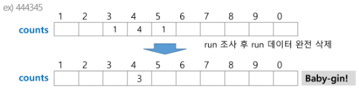
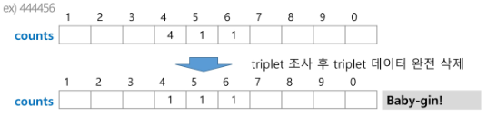

### 카운팅 정렬(Counting Sort)

- 항목들의 순서를 결정하기 위해 집합에 각 항목이 몇 개씩 있는지 세는 작업을 하여, 선형 시간에 정렬하는 효율적인 알고리즘

- 제한 사항
  
  - <u>정수나 정수로 표현할 수 있는 자료</u>에 대해서만 적용 가능 : 각 항목의 발생 회수를 기록하기 위해, 정수 항목으로 인덱스 되는 카운트들의 배열을 사용하기 때문
  
  - 카운트들을 위한 충분한 공간을 할당하려면 집합 내의 큰 정수를 알아야 함

- 시간 복잡도
  
  - O(n+k) : n은 리스트 길이,  k는 정수의 최대값


- [0, 4, 1, 3, 1, 2, 4, 1] 카운팅 정렬하는 과정

- 1단계 
  
  - Data에서 각 항목들의 발생 횟수를 세고, 정수 항목들로 직접 인덱스 되는 카운트 배열 counts에 저장
  
  `  for i in DATA : counts[i] +=1`

- counts[1] 을 감소시키고 Temp에 1을 삽입
  
  - 데이터의 맨 뒤부터 읽어오기 counts의 index [1]자리에 4라고 쓰여져있으면  Temp 4번째 자리에 1삽입

- counts[4]를 감소시키고 temp에 4를 삽입


```python
def Counting_Sort(A,B,k)
# A [] -- 입력된 배열 (0 to k)
# B [] -- 정렬된 배열
# C [] -- 카운트 배열

    C = [0 * (k+1]

    for i in range (0,len(A)):
        C[A[i]] += 1
    for i in range (1,len(C)):
        C[i] += C[i-1]
    for i in range (len(B)-1, -1, -1):
        C[A[i]] -= 1
        B[C[A[i]]] = A[i]
```

<br>

### Baby-gin Game

설명

- 0~9 사이의 숫자 카드에서 임의의 카드 6장 뽑았을 때, 3장의 카드가 연속적인 번호를 갖는 경우를 run이라 하고, 3장의 카드가 동일한 번호를 갖고 있는 경우를 triplet이라 함

- 6장의 카드가 run과 triplet로만 구성된 경우를 baby-gin

- 6자리의 숫자를 입력 받아 baby-gin 여부를 판단하는 프로그램 작성

> #### 완전검색(Exaustive Search)

- 완전 검색 방법은 문제의 해법으로 생각할 수 있는 모든 경우의 수를 나열해보고 확인하는 기법

- Brute-force 혹은 generate-and-test 기법

- 모든 경우의 수를 테스트한 후, 최종 해법 도출 - 경우의 수가 상대적으로 작을 때 유용

- 수행 속도는 느리지만, 해답을 찾아내지 못할 확률이 작음

> #### 완전검색을 활용한 Baby-gin 접근

- 고려할 수 있는 모든 경우의 수 생성하기
  
  - 6개의 숫자로 만들 수 있는 모든 숫자 나열

- 해답 테스트하기
  
  - 앞의 3자리와 뒤의 3자리 잘라, run과 triplet 여부를 테스트하고 최종적으로 판다

> ##### 순열을 어떻게 생성할 것인가

- 순열 (Permutation)
  
  - 서로 다른 것들 중 몇 개를 뽑아서 한 줄로 나열하는 것
  
  - 서로 다른 n개 중 r개를 택하는 순열 nPr
  
  - nPr = n!

- ex) {1,2,3}을 포함하는 모든 순열 생성하는 함수
  
  - 동일한 숫자가 포함되지 않았을 때, 각 자리 수 별 loop을 이용해 아래와 같이 구현 

```python
for i1 in range(1, 4):
    for i2 in range(1,4):
        if i2 != i1 :
            for i3 in range(1,4):
                if i3 != i1 and i3 != i2:
                    print(i1, i2, i3)
```

<br>

> #### 탐욕(Greedy) 알고리즘

- 탐욕 알고리즘은 최적해를 구하는 데 사용되는 근시안적인 방법

- 여러 경우 중 하나를 결정해야 할 때마다 그 순간에 최적이라고 생각되는 것을 선택해 나가는 방식으로 진행하여 최종적인 해답에 도달

- 각 선택의 시점에서 이루어지는 결정은 지역적으로는 최적이닞만 그 선택들을 계속 수집하여 최종적인 해답을 만들었다고 하여. 그것이 최적이라는 보장은 없음

- 일반적으로 머릿속에 떠오르는 생각을 검증 없이 바로 구현하면 Greedy 접근이 됨

> #### Greedy 동작 과정

1. 해 선택 : 현재 상태에서 부분 문제의 최적 해를 구한 뒤 이를 부분해집합에 추가

2. 실행 가능성 검사 : 새로운 부분해 집합이 실행 가능한지 확인 곧, 문제의 제약 조건을 위반하지 않는지 검사

3. 해 검사 : 새로운 부분해 집합이 문제의 해가 되는지 확인 아직 전체의 문제의 해가 완성되지 않았다면 1의 해 선택부터 다시 시작

> #### 거스름돈 줄이기

- "어떻게 하면 손님에게 거스름돈으로 주는 지폐와 동전의 개수를 최소한으로 줄일까?"

- 1) 해 선택 : 단위가 큰 동전으로만 거스름돈을 만들면 동전의 개수를 줄일 수 있음
  
  2) 실행 가능성 검사 : 거슬름돈이 내드려야 할 액수를 초과하는지 확인 초과한다면 마지막에 추가한 동전을 거스름돈에서 빼고 1로 돌아가 한 단계 작은 단위 동전 추가
  
  3) 해 검사 : 거스름돈이 손님에게 내드려야하는 액수와 일치하는지 확인

> #### Baby-gin을 Greedy로





```python
num= 4546789
```


