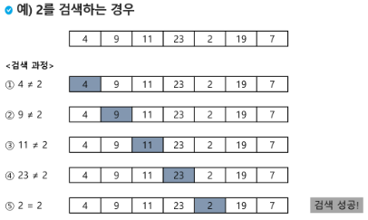
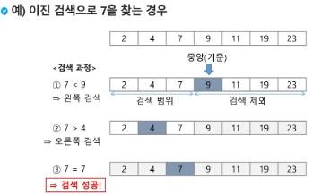
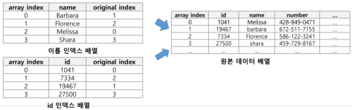

## 검색(Search)

- 저장되어 있는 자료 중에서 원하는 항목을 찾는 작업

- 목적하는 탐색 키를 가진 항목을 찾는 것
  
  - 탐색 키(search key) : 자료를 구별하여 인식할 수 있는 키

- 검색의 종류
  
  - 순차 검색(sequential search)
  
  - 이진 검색(binary search)
  
  - 해쉬(hash)

<br>

### 순차 검색(Sequential Search)

**일렬로 되어 있는 자료를 순서대로 검색하는 방법**

- 가장 간단하고 직관적인 검색 방법

- 배열이나 연결 리스트 등 순차구조로 구현된 자료구조에서 원하는 항목을 찾을 때 유용

- 알고리즘이 단순하여 구현이 쉽지만, 검색 대상의 수가 많은 경우에는 수행시간이 급격히 증가하여 비효율적

**2가지 경우**

- 정렬되어 있지 않은 경우

- 정렬되어 있는 경우

<br>

1. **<u>정렬되어 있지 않은 경우</u>**

**검색 과정**

- 첫 번째 원소부터 순서대로 검색 대상과 키 값이 같은 원소가 있는지 비교하며 찾음

- 키 값이 동일한 원소를 찾으면 그 원소의 인덱스 반환

- 자료구조의 마지막에 이를 때까지 검색 대상을 찾지 못하면 검색 실패



**찾고자 하는 원소의 순서에 따라 비교회수가 결정**

- 첫 번쨰 원소를 찾을 떄는 1번 비교, 두 번째 원소를 찾을 때는 2번 비교

- 정렬되지 않은 자료에서의 순차 검색의 평균 비교 회수
  
  - (1/n)*(1+2+3+...+n) = (n+1)/2

- 시간 복잡도 : O(n)

 **구현 예**

```python
def sequentialSearch(a, n, key)
    i <- 0
    while i<n and a[i]!=key: # 매우 흔하게 쓰는 용도
        i <- i+1
    if i<n : return i
    else : return -1
```

<br>

2. **<u>정렬되어 있는 경우</u>**

**검색 과정**

- 자료가 오름차순으로 정렬된 상태에서 검색을 실시한다 가정

- 자료를 순차적으로 검색하면서 키 값을 비교하여, 원소의 키 값이 검색 대상의 키 값보다 크면 찾는 원소가 없다는 것이므로 더 이상 검색하지 않고 검색을 종료


**찾고자 하는 원소의 순서에 따라 비교회수가 결정**

- 정렬이 되어있으므로, 검색 실패를 반환하는 경우 평균 비교 회수가 반으로 줄어듬

- 시간 복잡도 : O(n)

**구현 예**

```python
def sequentialSearch2(a, n, key)
    i <- 0
    while i<n and a[i]<key:
        i <- i+1
    if i<n and a[i] == key:
        return i
    else:
        return -1
```

<br>

### 이진검색(Binary Search)

- 자료의 가운데에 있는 항목의 키 값고 비교하여 다음 검색의 위치를 결정하고 검색을 계속 진행하는 방법
  
  - 목적 키를 찾을 때까지 이진 검색을 순환적으로 반복 수행함으로써 검색 범위를 반으로 줄여가면서 보다 빠르게 검색을 수행함

- 이진 검색을 하기 위해서는 자료가 정렬된 상태여야 함

**검색 과정**

- 자료의 중앙에 있는 원소 고름

- 중앙 원소의 값과 찾고자 하는 목표 값을 비교

- 목표 값이 중앙 원소의 값보다 작으면 자료의 왼쪽 반에 대해 새로 검색을 수행하고, 크다면 자료의 오른쪽 반에 대해 새로 검색 수행

- 찾고자 하는 값을 찾을 때까지 위의 과정 반복



**구현 (예)**

- 검색 범위의 시작점과 종료점 이용하여 검색 반복 수행

- 이진 검색의 경우, 자료에 사입이나 삭제 발생했을 때 배열의 상태를 항상 정렬 상태로 유지하는 추가 작업 필요 (단점)

```python
def binarySearch(a, N, key)
    start = 0
    end = N-1
    while start <= end: # 검색 구간이 남아 있으
        middle = (start + end)//2
        if a[middle] == key:            # 검색 성공
            return True
        elif a[middle] > key:
            end = middle -1
        else:
            start = middle +1
    return false                        # 검색 실패 
```

**재귀 함수 이용**

- 아래와 같이 재귀 함수를 이용하여 이진 검색 구현 가능 (그치만 반복 구조를 선호)

- 재귀 함수에 대해서 나중에 더 자세히

```python
def binarySearch2(a, low, high, key):
    if low > high:                        # 검색 실패 
        return False
    else:
        middle = (low + high) // 2
        if key == a[middle]:
            return True                   # 검색 성공 
        elif key < a[middle]:
            return binarySearch2(a, low, middle-1, key)
        elif a[middle] < key:
            return binarySearch1(a, middle+1, high, key)
```

<br>

<br>

## 인덱스

- 인덱스라는 용어는 Database에서 유래했으며, 테이블에 대한 동작 속도를 높여주는 자료 구조를 일컫음 -> Database 분야 아닌 곳에서는 Look up table 등의 용어도 사용

- 인덱스를 저장하는데 필요한 디스크 공간은 보통 테이블을 저장하는데 필요한 디스크 공간보다 작음

- 배열을 사용한 인덱스
  
  - 대량의 데이터를 매번 정렬하면 프로그램의 반응이 느려질 수 밖에
  
  - -> 대량 데이터의 성능 저하 문제를 해결하기 위해 배열 인덱스 사용 가능

- 다음 예에서 원본 데이터 배열과 별개로, 배열 인덱스를 추가한 예시



<br>

### 선택 정렬

- 주어진 자료들 중 가장 작은 값의 원소부터 차례대로 선택하여 위치를 교환하는 방식
  
  - 앞서 살펴본 셀렉션 알고리즘을 전체 자료에 적용한 것

- **정렬 과정**
  
  - 주어진 리스트 중 최소값 찾음
  
  - 그 값을 리스트의 맨 앞에 위치한 값과 교환
  
  - 맨 처음 위치를 제외한 나머지 리스트를 대상으로 위의 과정 반복

- 시간 복잡도
  
  - O(n2)

- **알고리즘**

```python
def SelectionSort(a[], n):
    for i from 0 to n-2:
        a[i],...,a[n-1] 원소 중 최소값 a[k] 찾음 
        a[i]와 a[k] 교환            
```

```python
def selectionSort(a, N):
    for i in range(N-1):
        minIdx = i
        for j in range(i+1, N):
            if a[minIdx] > a[j]:
                minIdx = j
        a[i], a[minIdx] = a[minIdx], a[i]
```

<br>

### 셀렉션 알고리즘(Selection Algorithm)

- 저장되어 있는 자료로부터 k번째로 큰 혹은 작은 원소를 찾는 방법
  
  - 최소값, 최대값 혹은 중간값을 찾는 알고리즘을 의미하기도 함

- 선택 과정
  
  - 셀렉션은 아래와 같은 과정
    
    - 정렬 알고리즘을 이용하여 자료 정렬
    
    - 원하는 순서에 있는 원소 가져오기

- 
