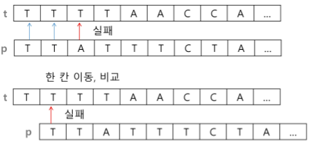
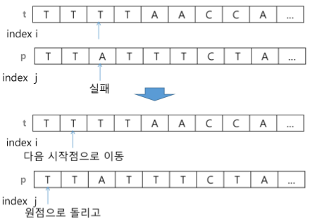
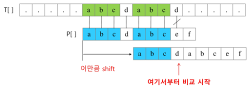
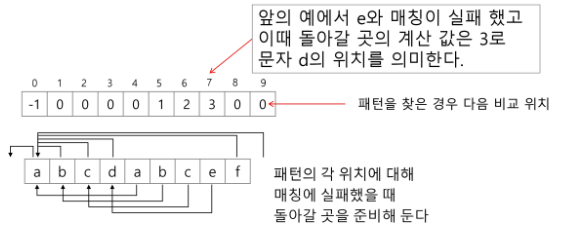
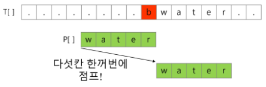
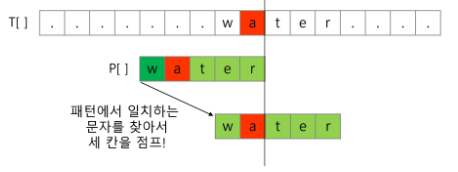
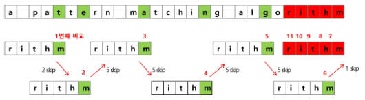

# 3. 문자열(string)

## 1) 문자열

## 2) 패턴 매칭

패턴 매칭에 사용되는 알고리즘

- 고지식한 패턴 검색 알고리즘

- 카프-라빈 알고리즘

- KMP 알고리즘

- 보이어-무어 알고리즘

<br>

#### 1 고지식한 알고리즘(Brute Force)

본문 문자열을 처음부터 끝까지 차례대로 순회하면서 패턴 내의 문자들을 일일이 비교하는 형식으로 동작



[ 알고리즘 설명 ]



```python
p = "is"    # 찾을 패턴 
t = "This is a book~!"    # 전체 텍스트  
M = len(p)    # 찾을 패턴의 길이
N = len(t)    # 전체 텍스트의 길이  

def BrutoForce(p, t):
    i = 0 # t의 인덱스 
    j = 0 # p의 인덱스
    while i < N and j < M : # 비교할 문장이 남아있고, 패턴을 찾기 전이면  
        if t[i] != p[j]:    # 서로 다른 글자를 만남녀 
            i -= j    # 비교를 시작한 위치로
            j = -1    # 패턴의 시작 전으
        i = i + 1
        j = j + 1
    if j == M : return i - M # 검색 성공
    else : return -1    # 검색 실패
```

```python
def bf2(p, t, N, M):    # 부분합 이용  
    for i in range(N-M+1):
        for j in range(M):
            if t[i] != p[j]:
                break
        else:
            return i
    return -1
print(bf(p, t, N, M))
```

** 검색하는 코드 짤 때 마지막 인덱스로 해보기 - 끝 지점 확인 주의 

```python
# 패턴이 나오는 개수 찾는 코드  
def bf2(p, t, N, M):
    cnt = 0  
    for i in range(N-M+1):
        for j in range(M):
            if t[i] != p[j]:
                break
        else:
            cnt += 1
    return cnt
print(bf(p, t, N, M))
```

- 시간 복잡도 : 최악의 경우 텍스트의 모든 위치에서 패턴을 비교해야 하므로 O(MN)
  
  - 길이가 10000인 문자열에서 길이 80인 패턴을 찾는다고 할 때, 최악의 경우 약 10,000 * 80 = 800,000 번의 비교가 일어남

<br>

#### 2 KMP 알고리즘

불일치가 발생한 텍스트 스트링의 앞 부분에 어떤 문자가 있는지를 미리 알고 있으므로, 불일치가 발생한 앞 부분에 대하여 다시 비교하지 않고 매칭을 수행

** 패턴 인덱싱만 바꾸기

- <u>패턴을 전처리하여 배열 next[M]을 구해서 잘못된 시작을 최소화함</u>
  
  - next[M] : 불일치가 발생했을 경우 이동할 다음 위치

- 시간 복잡도 : O(M+N)

- 아이디어 설명
  
  - 텍스트에서 abcdabc까지는 매치되고, e에서 실패한 상황 패턴의 맨 앞의  abc와 실패 직전의 abc는 동일함을 이용할 수 있음
  
  - 실패한 텍스트 문자와 P[4]를 비교함



- 매칭이 실패했을 때 돌아갈 곳을 계산함



<br>

#### 3 보이어-무어 알고리즘

- 오른쪽에서 왼쪽으로 비교

- 대부분의 상용 소프트웨어에서 채택하고 있는 알고리즘

- 보이어-무어 알고리즘은 패턴에 오른쪽 끝에 있는 문자가 불일치하고 이 문자가 패턴 내에 존재하지 않는 경우, 이동 거리는 무려 패턴의 길이만큼이 됨



- 오른쪽 끝에 있는 문자가 불일치하고 이 문자가 패턴 내에 존재할 경우



- 보이어-무어 알고리즘 이용한 예



rithm 문자열의 skip 배열

| m   | h   | t   | i   | r   | 다른 모든 문자 |
|:---:|:---:|:---:|:---:|:---:|:--------:|
| 0   | 1   | 2   | 3   | 4   | 5        |
