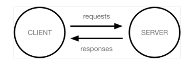
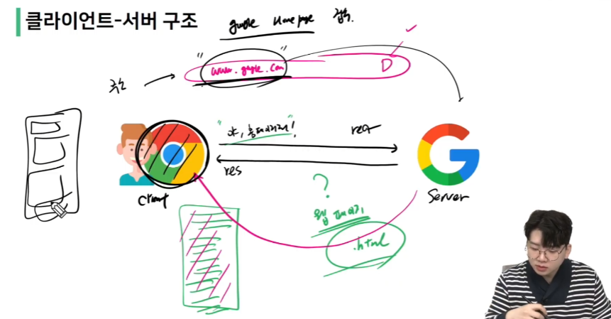
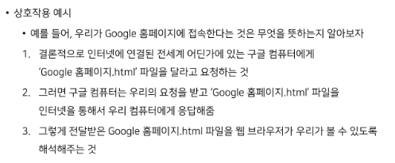
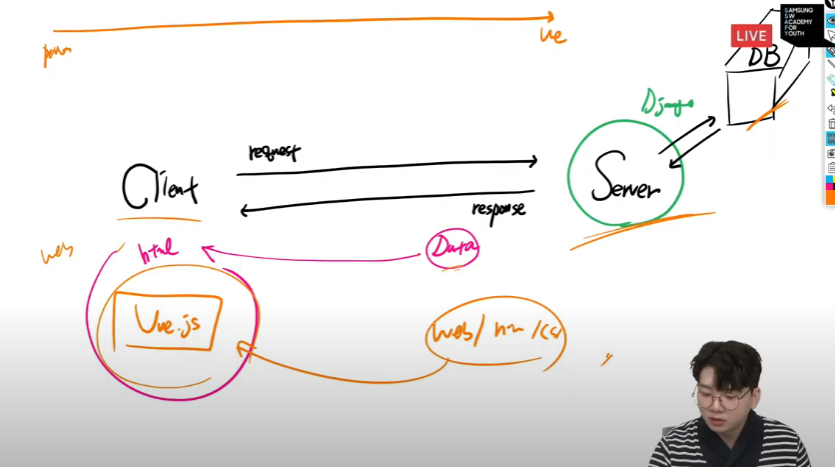
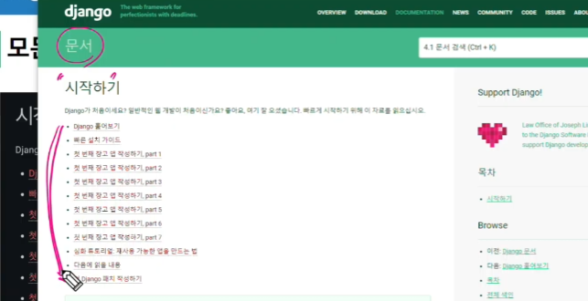
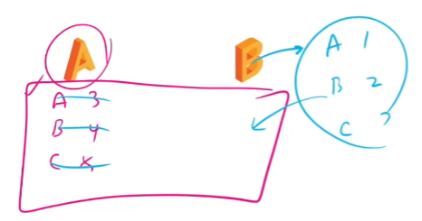
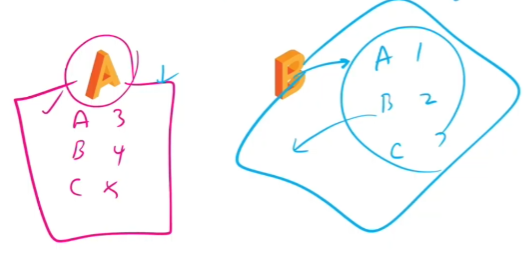

# Django

### framework

웹서비스 - 누군가 개발해 놓은 코드를 잘 재사용!

프레임워크(Framework): 뼈대, 틀 + 일하다

서비스 개발에 필요한 기능들을 미리 구현해서 모아 놓은 것

- 제공받은 도구들과 뼈대, 규약을 가지고 무언가를 만드는 일

- 특정 프로그램을 개발하기 위한 여러 도구들과 규약을 제공하는 것

-> 장점? 개발 속도 빨라짐 / 검증된 코드 / 반복을 줄이고 / 협업이 용이해짐

-> 단점? 선택의 폭이 좁아짐 / 러닝커브가 존재(학습곡선)

- framework 잘 사용하면 나만의 로직에 집중해 개발 가능

### Django

1. Python으로 작성된 프레임워크
   
   - 파이썬이라는 언어의 강력함과 거대한 커뮤니티

2. 수많은 여러 유용한 기능들

3. 검증된 웹 프레임워크
   
   - 화해,  Toss, 두나무, 당근마켓, 요기요 등
   
   - 유명한 많은 서비스들이 사용한다는 것 == 안정적으로 서비스를 할 수 있는 검증

### 클라이언트와 서버

**클라이언트**

- 웹 사용자의 인터넷에 연결된 장치

- Chrome 또는 Firefox와 같은 웹 브라우저

- 서비스를 요청하는 주체

**서버**

- ~~웹 페이지, 사이트 또는 앱을 저장하는 컴퓨터~~

- 클라이언트가 웹 페이지에 접근하려고 할 때 서버에서 클라이언트 컴퓨터로 웹 페이지 데이터를 응답해 사용자의 웹 브라우저에 표시됨

- <u>요청에 대해 서비스를 응답하는 주체</u>

구글 홈페이지 접속

크롬 웹브라우저 켬 (클라이언트) -> 주소창에다 구글.com 검색 (request)

요청 받는 구글(서버) -> 웹페이지 줌 .html 문서 (response) -> 줄글로 태그로 생긴 안예뻐..

이러한 코드를 웹브라우저가 해석해서 예쁜 화면으로 보여줌

*랜더링 찾아보기*

**정리**

- 우리가 사용하는 웹은 클라이언트-서버 구조로 이루어져 있음

- Django 는 서버를 구현하는 웹 프레임워크

따라해보기

### 가상환경

패키지와 가상환경

각각의 패키지를 하나의 환경에 담아야 한다면?

