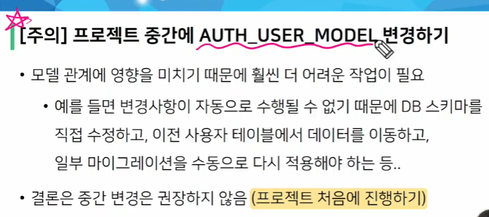
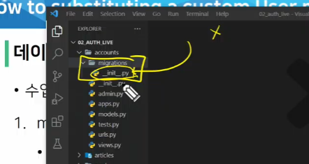
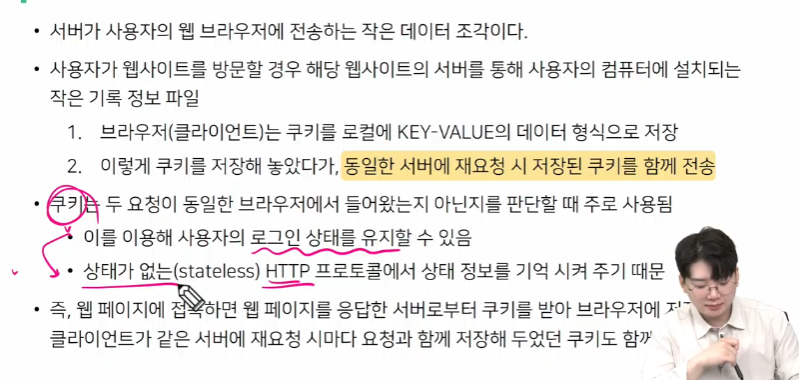
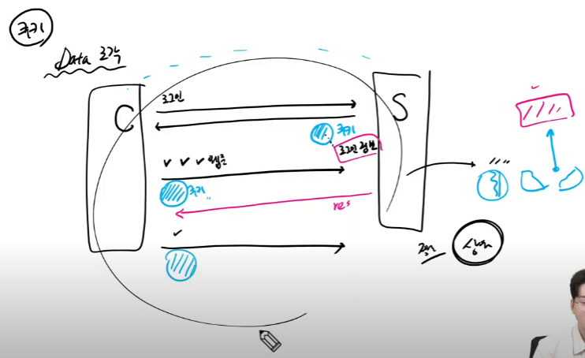

#### 1. 인증과 권한

- Django authentication system(인증 시스템)은 인증(Authentication)과 권한(Authorization)부여를 함께 제공(처리)하며, 이러한 기능을 일반적으로 인증 시스템이라고 함

- Authentication(인증) : 신원 확인 > 사용자가 자신이 누구인지 확인하는 것

- Authorization(권한, 허가) : 권한 부여 > 인증된 사용자가 수행할 수 있는 작업을 결정 

인증하려면 유저가 있어야함 -> 모델이 필요해야함 

#### 2. Custom User model

- "Custom User Model로 대체하기"

- Django는 현재 프로젝트에서 사용할 User Model을 결정하는 AUTH_USER_MODEL 설정 값으로 Default User Model을 재정의(override)할 수 있도록 함

> AUTH_USER_MODEL

- 프로젝트에서 User 을 나타낼 때 사용하는 모델

- 프로젝트가 진행되는 동안 (모델을 만들고 마이그레이션 한 후) 변경할 수 없음

- 프로젝트 시작 시 설정하기 위한 것이며, 참조하는 모델은 첫 번째 마이그레이션에서 사용할 수 있어야 함
  
  - 즉, 첫번째 마이그레이션 전에 확정 지어야 하는 값

- 다음과 같은 기본 값을 가지고 있음

```python
# settings.py
AUTH_USER_MODEL = 'auth.User'
```



기억해야함



모듈로 인식하는거지 지우면 안됨

#### 4. HTTP

> HTTP 특징

1. 비 연결 지향(connectionless)
   
   - 서버는 요청에 대한 응답을 보낸 후 연결을 끊음
     
     - 예를 들어 우리가 네이버 메인 페이지를 보고 있을 때 우리는 네이버 서버와 연결되어 있는 것이 아님
     
     - 네이버 서버는 우리에게 메인 페이지를 응답하고 연결을 끊은 것

2. 무상태(stateless)
   
   - 연결을 끊는 순간 클라이언트와 서버 간의 통신이 끝나며 상태 정보가 유지되지 않음
   
   - 클라이언트와 서버가 주고받는 메시지들은 서로 완전히 독립적

> 어떻게 로그인 상태를 유지할까?

- 우리가 로그인을 하고 웹 사이트를 사용할 때 페이지를 이동해도 로그인 "상태"가 됨

- 서버와 클라이언트 간 지속적인 상태 유지를 위해 '쿠키와 세션'이 존재

#### 5. 쿠키(Cookie)

- HTTP 쿠키는 상태가 있는 세션을 만들도록 해 줌





> 세션(Session)

- 사이트와 특정 브라우저 사이의 "state(상태)"를 유지시키는 것

- 클라이언트가 서버에 접속하면 서버가 특정 session id를 발급하고, 클라이언트는 session id를 쿠키에 저장
  
  - 클라이언트가 다시 동일한 서버에 접속하면 요청과 함께 쿠키(session id가 저장된)를 서버에 전달
  
  - 쿠키는 요청 때마다 서버에 함께 전송 되므로 서버에서 session id를 확인해 알맞은 로직을 처리

- session id는 세션을 구별하기 위해 필요하며, 쿠키에는 session id만 저장

> 쿠키 Lifetime(수명)

1. Session cookie
   
   - 현재 세션(current session)이 종료되면 삭제됨
   
   - 브라우저 종료와 함께 세션이 삭제됨

2. Persistent cookies
   
   - Expires 속성에 지정된 날짜 혹은 Max-Age 속성에 지정된 기간이 지나면 삭제됨
