# CSS Layout

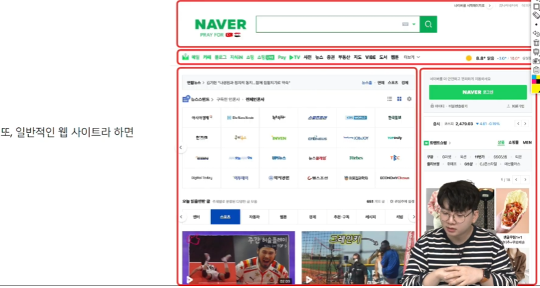

## Float

> CSS 원칙 1

모든 요소는 네모(박스모델)이고, 위에서부터 아래로, 왼쪽에서 오른쪽으로 쌓인다

(좌측 상단에 배치)

> Float

- 박스를 왼쪽 혹은 오른쪽으로 이동시켜 텍스트를 포함 인라인요소들이 주변을 wrapping 하도록 함

- 요소가 Normal flow를 벗어나도록 함

- none : 기본값 / left : 요소를 왼쪽으로 띄움 / right : 요소를 오른쪽으로 띄움

> 정리

- float는 레이아웃을 구성하기 위해 필수적으로 활용되었으나, 최근 Flexbox, Grid 등장과 함께 사용도가 낮아짐

- 활용 전략 - Normal Flow에서 벗어난 레이아웃 구성
  
  - 원하는 요소들을 Float로 지정하여 배치

## Flexbox

> CSS Flexible Box Layout

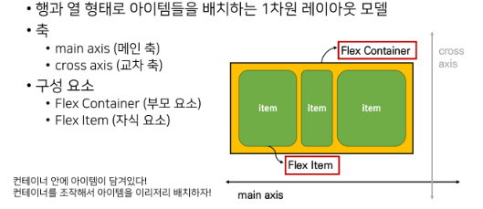

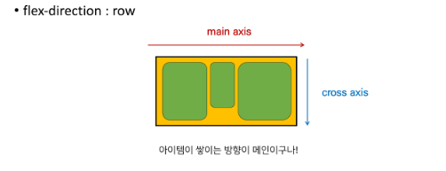

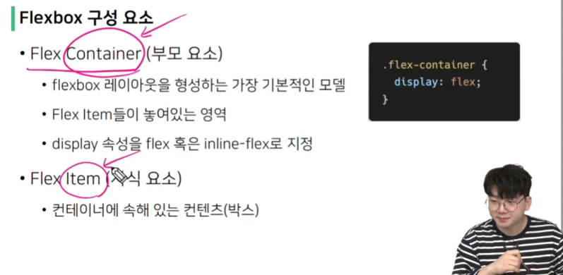

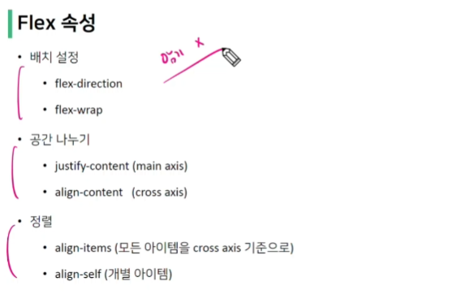

- flex-direction
  
  - Main axis 기준 방향 설정
  
  - 역방향의 경우 HTML 태그 선언 순서와 시각적으로 다르니 유의

- flex-wrap
  
  - 아이템이 컨테이너를 벗어나는 경우 해당 영역 내에 배치되도록 설정
  
  - 즉, 기본적으로 컨테이너 영역을 벗어나지 않도록 함
    
    - nowrap(기본 값) : 한 줄에 배치
    
    - wrap : 넘치면 그 다음 줄로 배치

- flex-flow
  
  - flex-direction 과 flex-wrap의 shorthand
  
  - flex-direction 과 flex-wrap에 대한 설정 값을 차례로 작성
  
  - 예시 ) flex-flow : row norwap;

> Flex 속성 : justify-content

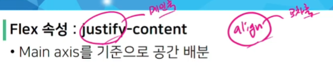

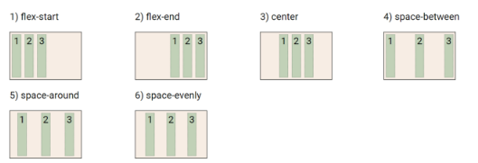

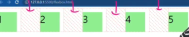

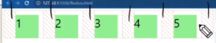

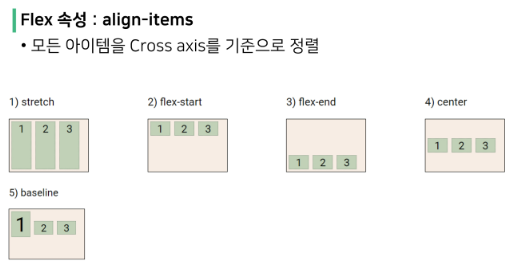

align-items: stretch; 기본값

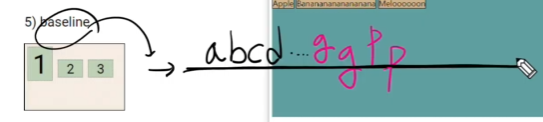

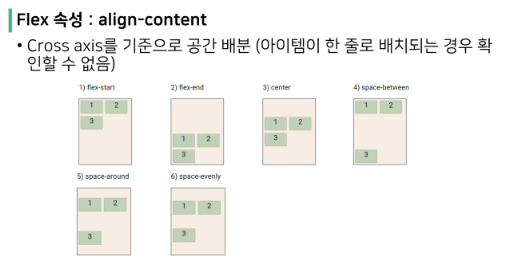
