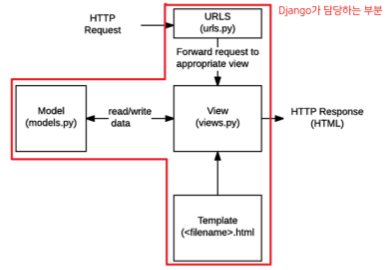
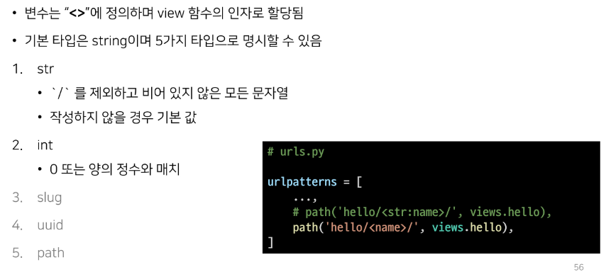
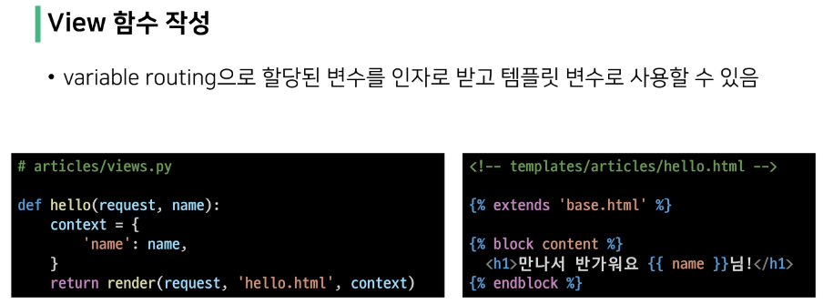

# Django

#### 1. Django 구조 이해하기 (MTV Design Pattern)

design pattern

각기 다른 기능을 가진 다양한 응용 소프트웨어를 개발 할 때 공통적인 설계 문제가 존재하며, 이를 처리하는 해결책 사이에도 공통점이 있다는 것을 발견 -> 이러한 유사점을 패턴

소프트웨어 디자인 패턴

- 클라이언트-서버 구조도 소프트웨어 디자인 패턴 중 하나

- 자주 사용되는 소프트웨어의 구조를 구조화 해둔 것

- 목적 : 공통적으로 발생하는 문제에 대해 재사용 가능한 해결책 제시

- 장점 : 다수의 엔지니어들 사이 커뮤니케이션 효율성이 높아짐

#### 2. Django's Design Pattern

django에 적용된 디자인 - M(Model;Data)T(Template;html?)V(View;logic) 패턴

이는 <u>MVC 디자인 패턴</u>을 기반으로 조금 변형

- Model - View - Controller 데이터 및 논리 제어를 구현하는데 널리 사용되는

- 하나의 큰 프로그램을 세가지 역할로 구분

MVC 목적 :

"관심사 분리" - 더 나은 업무의 분리와 향상된 관리 제공

각 부분을 독립적으로 개발할 수 있어, 하나를 수정하고 싶을 때 모두 건들지 않아도 됨

== 개발 효율성 및 유지보수가 쉬워짐

== 다수의 멤버로 개발하기 용이함

- model : 응용프로그램의 데이터 구조를 정의하고 데이터베이스의 기록을 관리

- template : 레이아웃과 화면 처리 / 화면 상 사용자 인터페이스 구조와 레이아웃 정의

- view : 관련 로직을 처리해서 응답을 반환 - 클라이언트 요청에 대해 처리를 분기하는 역할

##### 순서 (복습)

#### 3. Django Template

"데이터 표현을 제어하는 도구이자 표현에 관련된 로직"

Django Template 이용해 HTML 정적 부분과 <u>동적 컨텐츠</u> 삽입

html 코드가 길어지면 문자열로 적기 힘들어짐

> Django Template Language(DTL)

- Django Template 에서 사용하는 built-in template system

- 조건, 반복, 변수, 치환, 필터 등의 기능을 제공
  
  - Python 처럼 일부 프로그래밍 구조를 사용할 수 있지만 이것은 python 코드로 실행되는 것은 아님
  
  - 단순히 Python이 HTML에 포함 된 것이 아니니 주의

- 프로그래밍적 로직이 아니라 프레젠테이션을 표현하기 위한 것임을 명심할 것
1. Variable

2. Filters

3. Tags

4. Comments (주석)

> Variable

{{ variable }}

- 변수명은 영어, 숫자와 밑줄(_)의 조합으로 구성될 수 있으나 밑줄로는 시작 불가
  
  - 공백이나 구두점 문자 또한 사용할 수 없음

- dot(.)를 사용하여 변수 속성에 접근할 수 있음

- render()의 세번째 인자로 {'key':value}와 같이 딕셔너리 형태로 넘겨주며, 여기서 정의한 key에 해당하는 문자열이 template에서 사용 가능한 변수명이 됨

> Filters

{{ vairable| filter }}

- 표시할 변수를 수정할 때 사용

- 60여개의 built-in template filters 제공

- chained가 가능하며 일부 필터는 인자를 받기도 함

>  Tags

{ % tag %}

- 출력 텍스트를 만들거나, 반복 또는 논리를 수행하여 제어 흐름을 만드는 등 변수보다 복잡한 일들을 수행

- 일부 태그는 시작과 종료 태그가 필요

- 약 24개의 built-in template tags를 제공

> Comments

#### 4. Template inheritance

템플릿 상속

- 코드의 재사용성에 초점

- 사이트의 모든 공통 요소를 포함하고 하위 템플릿이 재정의 할 수 있는 블록을 정의하는 기본 'skeleton' 템플릿을 만들 수 있음

템플릿 상속에 관련된 태그

{ % extends '' %}

- 자식(하위)템플릿이 부모 템플릿을 확장한다는 것을 알림

- <mark>반드시 템플릿 최상단에 작성되어야 함 (즉, 2개 이상 사용할 수 없음)</mark>

{ % block content % }{ % endblock content % }

- 하위 템플릿에서 재지정할 수 있는 블록을 정의

- 즉, 하위 템플릿이 채울 수 있는 공간

#### 5. Variable routing

- URL 주소를 변수로 사용하는 것을 의미

- URL의 일부를 변수로 지정하여 view 함수의 인자로 넘길 수 있음

- 즉, 변수 값에 따라 하나의 path()에 여러 페이지를 연결 시킬 수 있음

#### 6. App URL mapping

