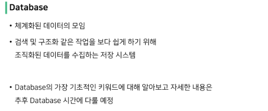

#### 1. Form & Data

Sending and Retrieving form data  

- 데이터를 보내고 가져오기

- HTML form element를 통해 사용자와 애플리케이션 간의 상호작용 이해하기

Client & Server architecture

- 웹은 다음과 같이 가장 기본적으로 클라이언트-서버 아키텍처를 사용
  
  - 클라이언트(일반적으로 웹 브라우저)가 서버에 요청을 보내고, 서버는 클라이언트의 요청에 응답

- 클라이언트 측에서 HTML form은 HTTP 요청을 서버에 보내는 가장 편리한 방법

- 이를 통해 사용자는 HTTP 요청에서 전달할 정보를 제공할 수 있음

#### 2. Sending form data (Client)

> HTML < form > element

- 데이터가 전송되는 방법을 정의

- 웹에서 사용자 정보를 입력하는 여러 방식 (text, button, submit 등)을 제공하고, 사용자로부터 할당된 데이터를 서버로 전송하는 역할을 담당

- "데이터를 어디(action)로 어떤 방식(method)으로 보낼지"
1. action
- 입력 데이터가 전송될 URL을 지정

- 데이터를 어디로 보낼 것인지 지정하는 것이며 이 값은 반드시 유효한 URL이어야 함

- 만약 이 속성을 지정하지 않으면 데이터는 현재 form이 있는 페이지의 URL로 보내짐
2. method
- 데이터를 어떻게 보낼 것인지 정의

- 입력 데이터의 HTTP request methods를 지정

- HTML form 데이터는 오직 2가지 방법으로만 전송 할 수 있는데 바로 GET 방식과 POST 방식

> HTML < input > element

- 사용자로부터 데이터를 입력 받기 위해 사용

- "type" 속성에 따라 동작 방식이 달라진다
  
  - input 요소의 동작 방식은 type 특성에 따라 현격히 달라지므로 각각의 type은 별도로 MDN 문서에서 참고하여 사용
  
  - type을 지정하지 않은 경우 기본값은 "text"

- name
  
  - form을 통해 데이터를 제출했을 때 name 속성에 설정된 값을 서버로 전송하고, 서버는  name 속성에 설정된 값을 통해 사용자가 입력한 데이터 값에 접근가능
  
  - 서버에 전달하는 파라미터(name은 key, value는 value)로 매핑하는 것

> HTTP request methods

- HTTP
  
  - HTML 문서와 같은 리소스(데이터, 자원)들을 가져올 수 있도록 해주는 프로토콜(규칙, 규약)

- 웹에서 이루어지는 모든 데이터 교환의 기초

- HTTP는 주어진 리소스가 수행할 원하는 작업을 나타내는 request methods를 정의

- 자원에 대한 행위(수행하고자 하는 동작)를 정의

- 주어진 리소스(자원)에 수행하길 원하는 행동을 나타냄

- HTTP Method 예시
  
  - Get, POST, PUT, DELETE

> GET

- 서버로부터 정보를 조회하는데 사용
  
  - 즉, 서버에서 리소스를 요청하기 위해 사용

- 데이터를 가져올 때만 사용해야 함

- 데이터를 서버로 전송할 때 Query String Parameters를 통해 전송
  
  - 데이터는 URL에 포함되어 서버로 보내짐

> Query String Parameters

- 사용잦가 입력 데이터를 전달하는 방법 중 하나로, url 주소에 데이터를 파라미터를 통해 넘기는 것

- 이러한 문자열은 앰퍼샌드&로 연결된 key=value 쌍으로 구성되며 기본 URL과 물음표(?)로 구분됨
  
  - ex) http://host:port/path?key=value&key=value

- Query String이라고도 함

- 정해진 주소 이후에 물음표를 쓰는 것으로 Query String이 시작함을 알림

- "key=value"로 필요한 파라미터의 값을 적음
  
  - "="로 key와 value가 구분됨

- 파라미터가 여러 개일 경우 "&"를 붙여 여러 개의 파라미터를 넘길 수 있음

#### 03. Retrieving the data(Server)

> Retrieving the data(Server)

- "데이터 가져오기(검색하기)"

- 서버는 클라이언트로 받은 key-value 쌍의 목록과 같은 데이터를 받게 됨

- 이러한 목록에 접근하는 방법은 사용하는 특정 프레임워크에 따라 다름

- 우리는 Django

## Database

> Database 기본 구조

1. 스키마(Schema)

2. 테이블(Table)

> 스키마(Schema)

- 뼈대(Structure)

- 데이터베이스에서 자료의 구조, 표현 방법, 관계 등을 정의한 구조
