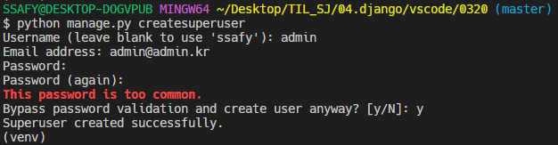
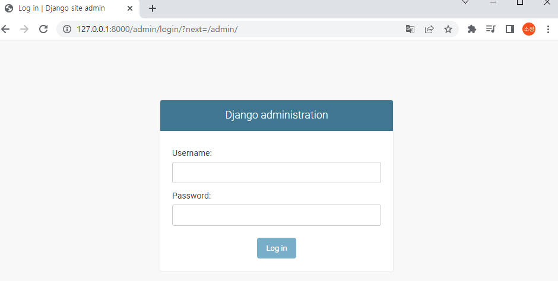
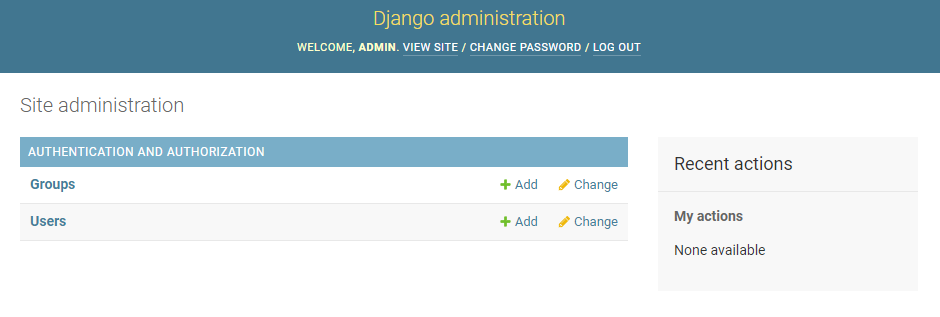
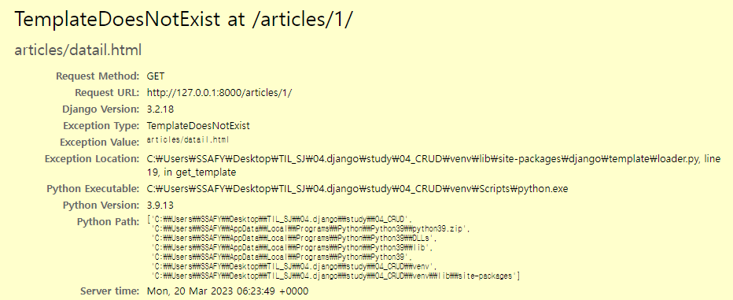
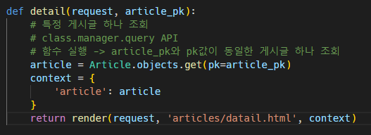

## Admint Site

- Django의 가장 강력한 기능 중 하나인 automatic admin interface

- "관리자 페이지"
  
  - 사용자가 아닌 서버의 관리자가 활용하기 위한 페이지
  
  - 모델 class를 admin.py에 등록하고 관리
  
  - 레코드 생성 여부 확인에 매우 유용하며 직접 레코드를 삽입할 수도 있음

오늘 난 오류

여기서 articles/1로 가니 템플릿이 없다..

articles/detail.html을 보여주는 곳이 views.py인데 가서 articles/detail.html을 불러오는 곳을 보니

detail이 아닌 datail로 해놔서... 열리지 않았음

