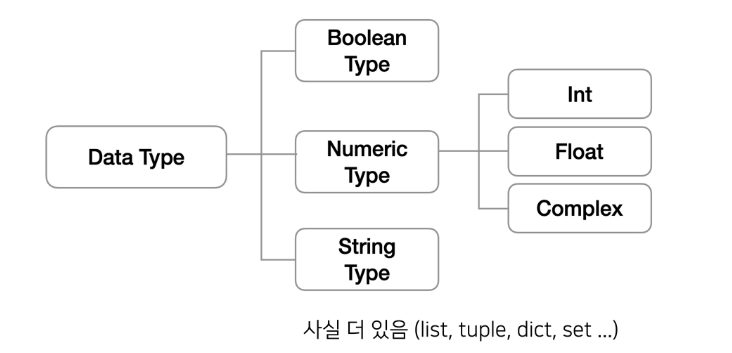
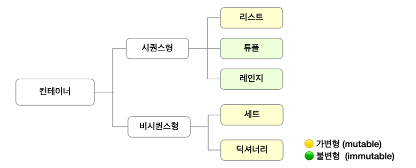
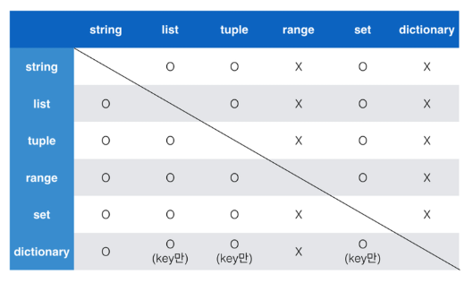

# <mark> Python</mark>

## 프로그래밍과 데이터

#### 프로그래밍이란?

소프트웨어 == 컴퓨터에게 일시키는 도구

만약 남들과 다른 일을 시키고 싶다면 ? -> 소프트웨어를 개발

> ##### 프로그래밍 (Programming)

소프트웨어를 개발하기 위한 과정 : 코딩(coding)의 다른 표현

컴퓨터에게 명령하는 적절한 수행 절차를 정의하고 이를 프로그래밍 언어로 표현하는 과정

> ##### 프로그래밍 과정

1. 컴퓨터에게 시키고 싶은 일을 정한다 ex) 계산 / 저장

2. 컴퓨터가 이해할 수 있도록 수행 절차를 정의해서 표현한다

3. **적절한 프로그래밍 언어**를 선택하고 언어를 이용해서 절차를 기술한다

4. 발생하는 오류를 수정한다
   
   1. 구문 오류 (syntax error) -> 전반기
   
   2. 논리 오류 (semantic error) -> 후반기

> ##### 컴퓨터 사고력 (Computational Thinking)

1. 컴퓨터의 특성을 잘 이해한다 understanding computer

2. 문제 해결 능력을 기른다 problem solving 논리적사고 == 작은 문제로 쪼개기

3. 프로그래밍 언어에 능숙해진다 trial & error

---

### Python 시작하기

> ##### 프로그래밍 언어란?

컴퓨터는 기계어(0과 1로 표현된 2진법)로 소통 

기계어의 대안으로 사람이 이해할 수 있는 새로운 언어 개발

-> **프로그래밍 언어**

프로그래밍 언어의 특징

- 사람이 이해할 수 있는 문자로 구성

- 기본적인 규칙과 문법이 존재

> ##### 프로그래밍 언어의 구성

소스 코드

- 프로그래밍 언어로 작성된 프로그램

번역기 (interpreter 혹은 compiler)

- 소스 코드를 컴퓨터가 이해할 수 있는 기계어로 번역

- 파이썬의 경우 인터프리터를 사용

> ##### 파이썬(Python)

파이썬의 특징

- 다른 프로그래밍 언어에 비해 문법이 간단하며, 엄격하지 않음

- 별도의 데이터 타입 지정이 필요 없으며, 재할당이 가능

- 문장을 구분할 때 중괄호를 사용하지 않고 들여쓰기 사용

- 소스코드를 기계어로 변환하는 컴파일 과정 없이 바로 실행 가능

- 객체 지향 프로그래밍 언어로 모든 것이 객체로 구현되어 있음

#### Python 개발환경

> ##### 파이썬 개발 환경 종류

- IDE : 통합 개발 환경의 약자로 개발에 필요한 다양하고 강력한 기능들을 모아둔 프로그램 보통 개발은 IDE로 진행함

- Jupyter Notebook : 문법 학습을 위한 최적의 도구로, 소스 코드와 함께 실행 결과와 마크다운 저장 가능 / open source 기반의 웹 플랫폼 및 어플리케이션으로, 파이썬을 비롯한 다양한 프로그래밍 언어를 지원하며 셀 단위의 실행이 가능한 것이 특징

- IDLE

---

### Python 기초 문법

#### 변수와 식별자

> ##### 변수 (Variable)

- 변수란?
  
  - 데이터를 저장하기 위해서 사용
  
  - 변수를 사용하면 복잡한 값들을 쉽게 사용할 수 있음

- 동일 변수에 다른 데이터를 언제든 할당(저장)할 수 있기 때문에, '변수'라고 불림

> ##### 추상화(변수를 사용해야 하는 이유)

- 코드의 가독성 증가

- 숫자를 직접 적지 않고, 의미 단위로 작성 가능

- 코드 수정이 용이해짐 - 아메리카노 가격이 변경되더라도 한곳만 수정하면 됨

> ##### 변수의 할당

- 변수는 할당 연산자(=)를 통해 값을 할당(assignment)

- 같은 값을 동시에 할당할 수 있음

- 다른 값을 동시에 할당할 수 있음

> ##### 식별자 (Identifiers)

변수의 이름을 식별자라고 함 (변수, 함수, 클래스 ...)

-> 읽기 쉽고 이해하기 쉬운 변수명이 최고

변수 이름 규칙

- 식별자의 이름은 영문 알파벳, 언더스코어(_), 숫자로 구성

- 첫 글자에 숫자가 올 수 없음

- 길이 제한이 없고, 대소문자를 구별

- 내장 함수나 모듈 등의 이름도 사용하지 않아야 함
  
  - 동작을 예상 할 수 없게 임의로 값을 할당하게 되므로 범용적이지 않은 코드가 됨

> ##### 주석

코드의 실행에 영향을 미치지 않는 나만의 메모

여러 줄도 가능

- 코드에 대한 쉬운 이해

- 유지보수 용이

- 협업 용이

##### 연산자

> ##### 산술 연산자 (Arithmetic Operator)

> ##### 연산자 우선순위

---

#### 자료형 (Data type)



> ##### 자료형과 메모리

데이터 10을 컴퓨터가 기억하는 과정

1. 10을 저장할 공간을 메모리에 만들고

2. 저장할 공간에 대한 주소를 할당받는다

3. 할당 받은 주소를 기억했다가 (4021555423)   => '주소값 기억이 어려움'

4. 10이라는 데이터를 해당 주소로 찾아가서 저장한다

5. 이후에 10이 필요해지면 해당 주소로 가서 읽어온다

-> 기억하기 쉬운 이름을 바꿔서 부르자!

    프로그래밍에서 우리가 사용하는 '**변수**'

                    my_score = 10

    [ [python] my_score | 4021555423 ]

변수 선언 (variable declaration)

대부분의 프로그래밍에서 가장 먼저 하는 일

> ##### 정리

프로그래밍에서 변수는 메모리의 주소를 기억하는 이름

우리는 변수를 이용해서 데이터를 기억

자료형마다 차지하는 메모리의 크기가 다름 (궁금하면 id() )

> ##### 자료형 분류

- 수치형 (Numeric Type)
  
  - int (정수,  integer)
  
  - float (부동소수점, 실수, floating point number)
  
  - complex(복소수, complex number)

- 문자열 (String Type)

- 불린형 (Boolean Type)

- None
  
  그리고 (list, tuple, range, dict, set ... ) 애들이 모여있는 자료형들

##### 수치형 (Numeric Type)

> ##### 정수 자료형 (int)

- 0, 100, -200과 같은 정수를 표현하는 자료형
  
  - 일반적인 수학 연산(사칙 연산) 가능

- 파이썬에서 표현할 수 있는 가장 큰 수
  
  - 파이썬에서 가장 큰 숫자를 활용하기 위해 sys모듈 불러오기
  
  ```python
  import sys
  max_int = sys.maxsize
  # sys.maxsize 의 값은 2**63 - 1 => 64비트에서 부호비트를 뺀 63개의 최대치
  print(max_int)
  super_max = sys.maxsize * sys.maxsize
  print(super_max)
  ```

> ##### 진수 표현

- 여러 진수 표현 가능
  
  - 2진수 (binary) : 0b
  
  - 8진수 (octal) : 0o
  
  - 16진수 (hexadecimal) : 0x

> ##### 실수 자료형 (float)

- 유리수와 무리수를 포함하는 '실수'를 다루는 자료형
  
  - 0.1, 100.0, -0.001등

- 정수를 이진수로 변환하는 건 쉽다, 하지만 소수라면? -> '부동 소수점' 주의
  
  - 부동 소수점 처리 방법
    
    1. 기본적인 처리 방법 : abs(a-b) <= 1e -10
    
    2. sys 모듈 통해 처리 방법 : import sys / abs(a-b)<=sys.float_info.epsilon
    
    3. math 모듈 통해 처리 방법 : import math / math.isclose(a,b)

##### 문자열 자료형 (String Type)

> ##### 문자열 자료형의 정의

- 모든 문자는 str 타입

- 문자열은 작은 따옴표나 큰따옴표를 활용하여 표기
  
  - 문자열을 묶을 때 동일한 문장부호를 활용
  
  - PEP8에서는 소스코드 내에서 하나의 문장부호를 선택하여 유지하도록 함

- Immutable / Iterable

> ##### 중첩 따옴표

- 따옴표 안에 따옴표를 표현할 경우
  
  - 작은따옴표가 들어 있는 경우는 큰따옴표로 문자열 생성
  
  - 큰따옴표가 들어 있는 경우는 작은따옴표로 문자열 생성

> ##### 삼중 따옴표 (Triple Quotes)

- 작은따옴표나 큰따옴표를 삼중으로 사용
  
  - 따옴ㅍ 안에 따옴표를 넣을 때, 여러 줄을 나눠 입력할 때 편리

> ##### Escape sequence

- 역슬레시(backslash)뒤에 특정 문자가 와서 특수한 기능을 하는 문자 조합 (제어 시퀀스)
  
  | 예약 문자 | 내용(의미)                         |
  |:-----:|:------------------------------:|
  | \n    | 줄 바꿈                           |
  | \t    | 탭                              |
  | \r    | 캐리지 리턴 ( aaaaa \r bbb -> bbba) |
  | \0    | 널(Null)                        |
  | \\\   | \                              |
  | \'    | 단일인용부호(')                      |
  | \"    | 이중인용부호(")                      |

> ##### 문자열 연산

> ##### String Interpolation  (문자열을 변수를 활용하여 만드는 법)

- %-formatting
  
  - `%d` : 정수
  
  - `%f` : 실수
  
  - `%s` : 문자열

```python
# name 변수에 이름, score 변수에 학점을 할당
name = 'Kim'
score = 4.5

# %-formatting 은 다음과 같이 사용
print('Hello, %s' % name) # Hello, Kim
print('내 성적은 %d' % score) # 내 성적은 4
print('내 성적은 %f' % score) # 내 성적은 4.500000
```

- `str.format()`

```python
# str.format()은 다음과 같이 사용
print('Hello, {}'.format(name)) # Hellp, Kim
```

- f-strings : python 3.6+

##### None

- 파이썬 자료형 중 하나

- 값이 없음을 표현하기 위해 None 타입이 존재

- 일반적으로 반환 값이 없는 함수에서 사용하기도 함

##### 불린형 (Boolean)

- 논리 자료형으로 참과 거짓을 표현하는 자료형

- True 또는 False를 값으로 가짐

- 비교 / 논리 연산에서 활용됨

> ##### 비교 연산자

- 수학에서 등호와 부등호와 동일한 개념

- 주로 조건문에 사용되며 값을 비교할 때 사용

- 결과는 True/ False 값을 반환함

> ##### 논리 연산자

- 여러 가지 조건이 있을 때
  
  - 모든 조건을 만족하거나, 여러 조건 중 하나만 만족해도 될 때 특정 코드를 실행하고 싶을 때 사용
  
  - 일반적으로 비교연산자와 함께 사용됨

> ##### 논리 연산자 주의할 점 / not 연산자

- Falsy : False는 아니지만 False로 취급 되는 다양한 값
  
  - 0, 0.0, (), [], {}, None, ""(빈 문자열)

- 논리 연산자도 우선순위가 존재
  
  - not, and, or 순으로 우선순위가 높음 (괄호 쓰세요)

> ##### 논리 연산자의 단축 평가

- 결과가 확실한 경우 두번째 값은 확인하지 않고 첫번째 값 반환

- and 연산에서 첫번째 값이 False인 경우 무조건 False => 첫번째 값 반환

- or 연산에서 첫번째 값이 True인 경우 무조건 True => 첫번째 값 반환

- 0은 False, 1은 True

---

#### 컨테이너

> ##### 컨테이너란? (모아서 관리하겠다)

- 여러 개의 값(데이터)을 담을 수 있는 것(객체)으로, 서로 다른 자료형을 저장할 수 있음
  
  - 예시 : List

- 컨테이너의 분류
  
  - 순서가 있는 데이터 (Ordered) vs 순서가 없는 데이터 (Unordered)
  
  - 순서가 있다 != 정렬되어 있다



---

#### 시퀀스형

##### 리스트

- 리스트는 여러 개의 값을 순서가 있는 구조로 저장하고 싶을 떄 사용

> ##### 리스트의 생성과 접근

- 리스트는 대괄호 ([]) 혹은 list () 를 통해 생성
  
  - 파이썬에서는 어떠한 자료형으로 저장할 수 있으며, 리스트 안에 리스트도 넣을 수 있음
  
  - 생성된 이후 내용 변경이 가능 -> 가변 자료형
  
  - 이러한 유연성 때문에 파이썬에서 가장 흔히 사용

- 순서가 있는 시퀀스로 인덱스를 통해 접근 가능
  
  - 값에 대한 접근은 list[i]

##### 튜플

> ##### 튜플의 정의

- 튜플은 여러 개의 값을 순서가 있는 구조로 저장하고 싶을 때 사용
  
  - 리스트와의 차이점은 생성 후, 담고 있는 값 변경이 불가 (불변 자료형)

- 항상 소괄호 형태로 사용

> ##### 튜플의 생성과 접근

- 소괄호 (()), 혹은 tuple () 을 통해 생성

- 튜플은 수정 불가능한 (immutable) 시퀀스로 인덱스로 접근 가능

- 값에 대한 접근은 my_tuple[1]

> ##### 튜플(Tuple) 생성 주의사항

- 단일 항목의 경우
  
  - 하나의 항목으로 구성된 튜플은 생성 시 값 뒤에 쉼표를 붙여야 함

- 복수 항목의 경우
  
  - 마지막 항목에 붙은 쉼표는 없어도 되지만, 넣는 것을 권장 (Trailing comma)

##### Range

> ##### Range의 정의

- 숫자의 시퀀스를 나타내기 위해 사용

- 주로 반복문과 함께 사용됨

> ##### Range의 기본 사용 방법

- 기본형 : range (n)
  
  - 0부터 n-1까지의 숫자의 시퀀스

- 범위 지정 : range (n,m)
  
  - n부터 m-1까지의 숫자의 시퀀스

##### 슬라이싱 연산자

> ##### 시퀀스를 특정 단위로 슬라이싱

- 인덱스와 콜론을 사용하여 문자열의 특정 부분만 잘라낼 수 있음

- 슬라이싱을 이용하여 문자열을 나타낼 때 콜론을 기준으로 앞 인덱스에 해당하는 문자는 포함되지만 뒤 인덱스에 해당 문자는 미포함

---

#### 비시퀀스형 컨테이너

##### 딕셔너리 (Dictionary)

> ##### 딕셔너리의 정의

- 키-값(key-value) 쌍으로 이뤄진 자료형

- Dictionary 의 키(key)
  
  - key는 변경 불가능한 데이터(immutable)만 활용 가능
    
    - string, integer, float, boolean, tuple, range

- 각 키의 값(values)
  
  - 어떠한 형태든 관계 없음

> ##### 딕셔너리 (Dictionary) 생성

- 중괄호 ({}) 혹은 dict()을 통해 생성

- key를 통해 value에 접근

---

##### 형 변환 (Typecasting)

> ##### 형변환이란

- 데이터 형태는 서로 변환할 수 있음

- 암시적 형 변환 (Implicit)
  
  - 사용자가 의도하지 않고, 파이썬 내부적으로 자료형을 변환하는 경우

- 명시적 형 변환 (Explicit)
  
  - 사용자가 특정 함수를 활용하여 의도적으로 자료형을 변환하는 경우

> ##### 암시적 형 변환

- 사용자가 의도하지 않고, 파이썬 내부적으로 자료형을 변환하는 경우
  
  - bool
  
  - Numeric type (int, float)

> ##### 명시적 형 변환

- int
  
  - str, float => int
  
  - 단, 형식에 맞는 문자열만 정수로 변환 가능

- float
  
  - str(참고), int => float
  
  - 단, 형식에 맞는 문자열만 정수로 변환 가능

- str
  
  - int, float, list, tuple, dict => str

> ##### 컨테이너 형 변환

- 컨테이너 간의 형 변환은 아래와 같이 가능


