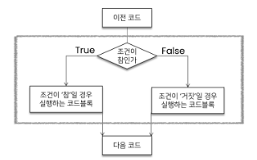
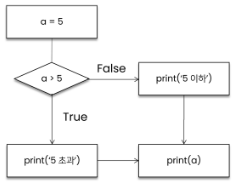
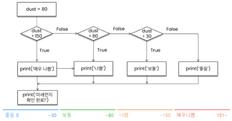
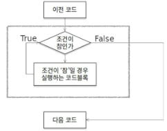
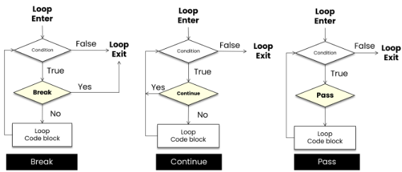

## <mark> 제어문(Control Statement)</mark>

> ##### 제어문

- 순차, 선택, 반복

- 파이썬은 기본적으로 위에서부터 아래로 차례대로 명령을 수행

- 특정 상황에 따라 코드를 선택적으로 실행(분기/조건)하거나 계속하여 실행(반복)하는 제어가 필요함

- 제어문은 순서도(flowchart)로 표현이 가능

---

## 코드 스타일 가이드

> ##### 코드 스타일 가이드

- 코드를 '어떻게 작성할지'에 대한 가이드라인

- 파이썬에서 제안하는 스타일 가이드 (강의에서 사용)
  
  - PEP8

- 각 회사/ 프로젝트마다 따로 스타일 가이드를 설정하기도 함
  
  - Google Style guide  

> #### 들여쓰기

- Space Sensitive
  
  - 문장을 구분할 때, 중괄호 ( {,}) 대신 들여쓰기 (indentation)를 사용
  
  - 들여쓰기를 할 때는 4칸 혹은 1탭을 입력
    
    - 주의! 한 코드 안에서는 반드시 한 종류의 들여쓰기를 사용
      
      -> 혼용 금지
    
    - Tab으로 들여쓰면 계속 탭으로 들여써야 함
    
    - 원칙적으로는 공백(빈칸,space) 사용을 권장 *PEP8 권장사항  

---

## <mark>조건문(Conditional Statement)</mark>

> ##### 조건문

- 조건문은 참/거짓을 판단할 수 있는 조건식과 함께 사용



*순서도 - 다이아몬드(조건)*  

> ##### 기본 형식

- 조건에는 참/거짓에 대한 조건식
  
  - 조건이 참인 경우 들여쓰기 되어있는 코드 블록을 실행
  
  - 이외의 경우 else 이후 들여쓰기 되어있는 코드 블록을 실행
    
    - else는 선택적으로 활용할 수 있음  

> ##### 조건문 예시

- 아래의 순서도를 코드로 나타내시오



```python
a=5
if a>5 :
    print('5초과')
else :
    print('5이하')
print(a)
```

> ##### 조건문 실습 문제

- 조건문을 통해 변수 num의 값의 홀수/짝수 여부를 출력하시오.
  
  - 이때  num은 input을 통해 사용자로부터 입력을 받으시오.

```python
num=int(input("숫자를 입력하세요: "))
if num%2==0:
    print("짝수")
else:
    print("홀수")
```

---

## 복수 조건문

> ##### 복수 조건문

- 복수의 조건식을 활용할 경우 elif를 활용하여 표현함  

> ##### 복수 조건문 실습 문제

- 미세먼지 농도에 따른 위험 등급이 다음과 같을 때, dust 값에 따라 등급을 출력하는 조건식을 작성하시오.
  
  (단, 조건식 완료 후 미세먼지 확인 완료라는 문구를 출력)

```python
dust=int(input())

if dust <=30 :
    print("좋음")
elif dust <=80 :
    print("보통")
elif dust <=150 :
    print("나쁨")
else :
    print("매우나쁨")
print("미세먼지 확인 완료")
```



*복수 조건문 실습 문제 순서도*  

---

## 중첩 조건문

> ##### 중첩 조건문

- 조건문은 다른 조건문에 중첩되어 사용될 수 있음
  
  - 들여쓰기에 유의하여 작성할 것

- 아래의 코드에서 **중첩 조건문을 활용하여** 미세먼지 농도(dust값)가 300이 넘는 경우
  
  '실외 활동을 자제하세요'를 추가로 출력하고 음수인 경우 '값이 잘못되었습니다'를 출력하시오.  

```python
d=int(input())

if d > 150 :
    print("매우나쁨")
    if d>300:
        print("실외 활동을 자제하세요.")
elif d>80 :
    print("나쁨")
elif d>30 :
    print("보통")
elif d >=0 :
    print("좋음")
else:
    print("실외 활동을 자제하세요")
print("미세먼지 확인 완료")
```

---

## 조건 표현식

> ##### 조건 표현식

- 조건 표현식(Conditional Expression)이란?
  
  - 조건 표현식을 일반적을 조건에 따라 값을 정할 때 활용
  
  - 삼항 연산자(Ternary Operator)로 부르기도 함
  
          [ true 인 경우 값 if 조건 else false인 경우 값 ]  

> ##### 조건 표현식 실습 문제

- num이 정수일 때, 아래의 코드는 무엇을 위한 코드일까요?

                [ value = num if num >=0 else -num ]

                : 절대값을 저장하기 위한 코드  

```python
value= print("홀수") if num%2 else print("짝수")
```

---

## <mark> 반복문</mark>

> ##### 반복문

- 특정 조건을 만족할 때까지 같은 동작을 계속 반복하고 싶을 때 사용



> ##### 반복문의 종류

- while문
  
  - 종료 조건에 해당하는 코드를 통해 반복문을 종료시켜야 함

- for문
  
  - 반복가능한 객체를 모두 순회하면 종료(별도의 종료 조건이 필요 없음)

- 반복 제어
  
  - break, continue, for-else

## <mark> While문</mark>

> ##### While문

- while문은 조건식이 참인 경우 반복적으로 코드를 실행
  
  - 조건이 참인 경우 들여쓰기 되어 있는 코드 블록이 실행됨
  
  - 코드 블록이 모두 실행되고, 다시 조건식을 검사하며 반복적으로 실행됨
  
  - while문은 무한 루프를 하지 않도록 종료 조건이 반드시 필요  

> ##### 복합 연산자(In-Place Operator)

- 복합 연산자는 연산과 할당을 합쳐 놓은 것
  
  - 예시) 반복문을 통해서 개수를 카운트 하는 경우

## <mark> for 문</mark>

> ##### for문

- for문은 시퀀스(string,tuple,list,range)를 포함한 순회 가능한 객체(iterable)의 요소를 모두 순회
  
  - 처음부터 끝까지 모두 순회하므로 별도의 종료 조건이 필요하지 않음

- Iterable
  
  - 순회할 수 있는 자료형(string, list, dict, tuple, range, set 등)
  
  - 순회형 함수(range, enumerate)

> ##### for문을 이용한 문자열(string) 순회

- 사용자가 입력한 문자를 한 글자씩 출력하시오. (haapy입력)

```python
chars=input()
for char in chars:
    print(char)
#happy


for idx in range(len(chars)):
    print(chars[idx])
```

> ##### 딕셔너리(Dictionary) 순회

- 딕셔너리는 기본적으로 key를 순회하며, key를 통해 값을 활용

```python
grades = {'john':80, 'eric':90}
for student in grades:
    print(student)

# john
# eric

grades = {'john':80, 'eric':90}
for student in grades:
    print(student, grades[student])

# john 80
# eric 90
```

> ##### 추가 메서드를 활용한 딕셔너리(Dictionary) 순회

- 추가 메서드를 활용하여 순회할 수 있음
  
  - keys() : key로 구성된 결과
  
  - values() : value로 구성된 결과
  
  - items() : (key,value)의 튜플로 구성된 결과

```python
grades = {'john':80, 'eric':90}
print(grades.keys())
print(grades.values())
print(grades.items())


# dict_keys {['john', 'eric']}
# dict_values {[80, 90]}
# dict_items {[('john',80),('eric' ,90)]}


grades = {'john':80, 'eric':90}
for student,grade in grades.items():
    print(student, grade)

# john 80
# eric 90
```

> ##### enumerate 순회

- enumerate()
  
  - 인덱스와 객체를 쌍으로 담은 열거형(enumerate) 객체 반환
    
    - (*index, value*) 형태의 tuple로 구성된 열거 객체를 반환

```python
members = ['민수', '영희', '철수']

for idx, number in enumerate(members):
    print(idx,number)


# 0 민수
# 1 영희
# 2 철수


members = ['민수', '영희', '철수']
enumerate(members)
print(list(enumerate(members))) # [(0, '민수'),(1, '영희'),(2, '철수')]
print(list(enumerate(members, start=1))) 
# [(1, '민수'),(2, '영희'),(3, '철수')]

# 기본값 0, start를 지정하면 해당 값부터 순차적으로 증가
```

> ##### List Comprehension

- 표현식과 제어문을 통해 특정한 값을 가진 리스트를 간결하게 생성하는 방법

[code for 변수 in interable]

[code for 변수 in interable if 조건식]

```python
# 1~3의 세제곱 리스트 만들기
cubic_list=[]
for number in range(1,4):
    cubic_list.append(number ** 3)
print(cubic_list)

# [1, 8, 27]

cubic_list = [number ** 3 for number in range(1,4)]
print(cubic_list)

# [1, 8, 27]
```

> ##### Dictionary Comprehension

- 표현식과 제어문을 통해 특정한 값을 가진 딕셔너리를 간결하게 생성하는 방법

{key:value for 변수 in interable}

{key:value for 변수 in interable if 조건식}

```python
# 1~3의 세제곱 딕셔너리 만들기
cubic_dict ={}

for number in range(1,4):
    cubic_dict[number] = number **3
print(cubic_dict)

# {1: 1, 2: 8, 3: 27}

cubic_dict={number: number ** 3 for number in range(1,4)}
print(cubic_dict)

# {1: 1, 2: 8, 3: 27}
```

## 반복문 제어

> ##### 반복문 제어

- break
  
  - 반복문을 종료

- continue
  
  - continue 이후의 코드 블록은 수행하지 않고, 다음 반복을 수행

- for-else
  
  - 끝까지 반복문을 실행한 이후에 else문 실행
    
    - break를 통해 중간에 종료되는 경우 else문은 실행되지 않음

- pass
  
  - 아무것도 하지 않음(문법적으로 필요하지만, 할 일이 없을 때 사용)


