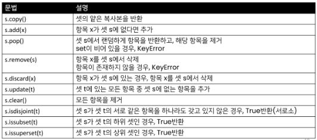
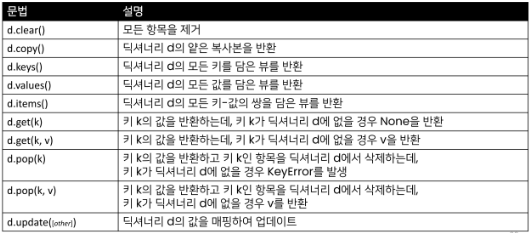

## 데이터 구조

> ##### 데이터 구조란?

```python
# 문자열이 주어지면 숫자, 문자, 기호가 몇개인지 출력하는 함수를 만들어라.
 
def check(input_str):
    char_count =0
    digit_count=0
    symbol_count=0

    for char in input_str:
        if char.isalpha(): #문자열인지 확인하는 메소드
            char_count += 1

        elif char.isdigit(): #숫자인지 확인하는 메소드
            digit_count += 1
        else:
            symbol_count +=1

    return char_count, digit_count, symbol_count

input_str = "123#%$aiden_snow"
char_count,digit_count, symbol_count = check(input_str)
print(f"char: {char_count}, digit: {digit_count}, symbol: {symbol_count}")
```

- 데이터 구조(Data Structure)
  
  - 여러 데이터를 효과적으로 사용, 관리하기 위한 구조
  
  - 파이썬에는 대표적으로 List, Tuple, Dict, Set 등의 데이터 구조가 있음

<br>

> ##### 자료구조

- 컴퓨터 공학에서는 '자료구조'라고 함

- 각 데이터의 효율적인 저장, 관리를 위한 구조를 나눠 놓은 것

<br>

<br>

## 순서가 없는 데이터 구조

> ##### 셋(Set)

- Set이란 중복되는 요소가 없이, 순서에 상관없는 데이터들의 묶음
  
  - 데이터의 중복을 허용하지 않기 때문에 중복되는 원소가 있다면 하나만 저장
  
  - 순서가 없기 때문에 인덱스를 이용한 접근 불가능

- 수학에서의 집합을 표현한 컨테이너
  
  - 집합 연산이 가능(여집합을 표현하는 연산자는 별도로 존재 X)
  
  - 중복된 값이 존재하지 않음

- 담고 있는 요소를 삽입 변경, 삭제 가능 -> 가변 자료형(mutable)

<br>



<br>

<br>

> ##### 딕셔너리(Dictionary)

- 키 - 값 (key-value) 쌍으로 이뤄진 자료형

- Dictionary의 키(key)
  
  - key는 변경 불가능한 데이터 (immutable)만 활용 가능
    
    - string, integer, float, boolean, tuple, range

- 각 키의 값(values)
  
  - 어떠한 형태든 관계없음

<br>




---

## 얕은 복사와 깊은 복사

> ##### 자료형과 메모리

- 기존 변수 사용 과정의 문제점 : 하나의 기억에 하나의 주소가 필요

- 연속된 공간에 데이터가 저장되도록 함 -> 맨 처음 기억의 주소만 가지고 있으면 됨

<br>

> ##### 할당(assignment)

- 대입 연산자 (=) : 리스트 복사 확인하기

> ##### 얕은 복사(shallow copy)

- Slice 연산자 활용하여 같은 원소를 가진 리스트지만 연산된 결과를 복사(다른 주소)

```python
a=[1,2,3]
b=a[:]
print(a,b) # [1,2,3] [1,2,3]
b[0]=5
print(a,b) # [1,2,3] [5,2,3]
```

> ##### 얕은 복사 주의사항 - 복사하는 리스트의 원소가 주소를 참조하는 경우

```python
a=[1,2,['a','b']]
b=a[:]
print(a,b) # [1,2,['a','b']] [1,2,['a','b']]
b[2][0] =0
print(a,b) # [1,2,[0,'b']] [1,2,[0,'b']]
```

> ##### 깊은 복사( deep copy)

둘의 구분이 명확하진 않음

- 리스트 복사 확인하기

```python
import copy
a=[1,2,['a','b']]
b=copy.deepcopy(a)
print(a,b) # [1,2,['a','b']] [1,2,['a','b']]
b[2][0] =0
print(a,b) # [1,2,['a','b']] [1,2,[0,'b']]
```

=> 리스트를 복사하고 싶다면 무조건 print 찍어볼 것


