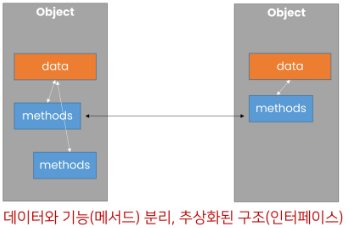
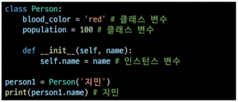
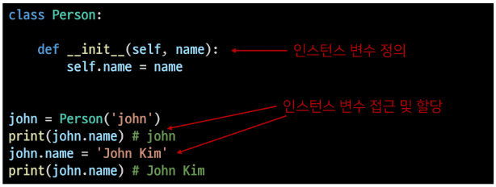
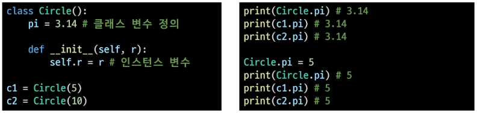
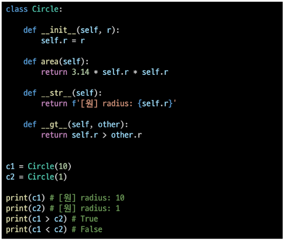
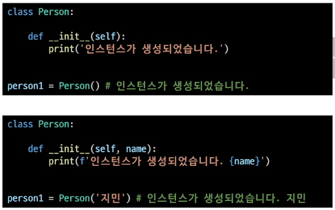

## Python

### 객체 지향 프로그래밍

> ##### 객체 지향 프로그래밍

- 객체 지향 프로그래밍 (Object-Oriented Programming, OOP)은 컴퓨터 프로그래밍의 패러다임 중 하나
  
  - **<u>컴퓨터 프로그램을 명령어의 목록을 보는 시각에서 벗어나</u>** 여러 개의 독립된 단위, 즉 "객체"들의 모임으로 파악하고자 하는 것 -> 각 객체는 메세지를 주고받고, 데이터 처리 가능 

> ##### 절차 지향 프로그래밍

- 프로그램을 하나의 흐름으로 보자
  
  - 프로그램 전체가 유기적인 흐름으로 연결 -> 기능 중심의 프로그램
  
  - 순서가 정해져 있으므로 실행이 빠름
  
  - 하나의 부분이 망가지거나 고치려하면 연관되어 있는 모든 부분을 고쳐야만 함

- 하드웨어의 발전 속도를 소프트웨어의 발전 속도가 따라가지 못함
  
  - **소프트웨어 위기** -> '절차'대신 핵심이 되는 '데이터'를 중심으로 생각

- 데이터를 중심으로 절차를 도입해서, 현실의 사물을 나타내고 이런 것들을 조립하는 방식으로 개발하자 == OOP

 

 

> ##### 객체 지향 프로그래밍

**<u>프로그램을 여러 개의 독립된 객체들과 그 객체 간의 상호작용으로 파악하는 프로그래밍 방법 (절차 지향 프로그래밍을 포함)</u>**

- 필요한 이유 : 현실 세계를 프로그램 설계에 반영(추상화)

- 장점
  
  - 객체는 잘 만들어놓으면 계속해서 재사용이 가능
  
  - 객체는 그 자체로 데이터와 행동이 정의됨(독립적) == 개발자가 내부 구조를 몰라도 그냥 가져다가 다른 객체와 조립하면서 개발이 가능
  
  - 객체 단위로 모듈화시켜 개발할 수 있으므로 많은 인원이 참여하는 대규모 소프트웨어 개발 가능
  
  - <u>개발 용의성, 유지 보수 편의성, 신뢰성을 바탕으로 생산성이 대폭 증가!</u>

- 단점
  
  - 설계 시 많은 노력과 시간이 필요
    
    - 다양한 객체들의 상호 작용 구조를 만들기 위해 많은 시간과 노력이 필요
  
  - 실행 속도가 상대적으로 느림
    
    - 절차 지향 프로그래밍이 컴퓨터의 처리구조와 비슷해서 실행 속도가 빠름

 

 

### OOP 기초

> ##### 객체

- 컴퓨터 과학에서 객체 또는 오브젝트(object)는 **클래스에서 정의한 것을 토대로 메모리(실제 저장공간)에 할당한 것**으로 프로그램에서 사용되는 데이터 또는 식별자에 의해 참조되는 공간을 의미하며, 변수, 자료 구조, 함수 또는 메서드가 될 수 있다

- 속성과 행동으로 구성된 모든 것

 

> ##### 객체와 인스턴스

- 클래스로 만든 객체를 인스턴스라고도 함

- 파이썬은 모든 것이 객체 == <u>파이썬의 모든 것엔 속성과 행동이 존재</u>

- 객체의 특징
  
  - 타입 : 어떤 연산자와 조작이 가능한가?
  
  - 속성 : 어떤 상태(데이터)를 가지는가?
  
  - 조작법 : 어떤 행위(함수)를 할 수 있는가? 
    
    - 객체 = 속성 + 기능

 

## 객체와 클래스 문법

### OOP 문법

> ##### 기본 문법

- 클래스 정의       |  class Myclass: -> 나만의 타입을 만드는 것

- 인스턴스 생성   |  my_instance = MyClass()

- 메서드 호출      |  my_instance.my_method()

- 속성 접근          |  my_instance.my_attribute

 

> ##### 클래스와 인스턴스

- 클래스 : 객체들의 분류 / 설계도(class)

- 인스턴스 : 하나하나의 실체 / 예(instance)

> ##### 객체 비교하기

- ==
  
  - 동등한 : 변수가 참조하는 객체가 동등한(내용이 같은)경우 True
  
  - 두 객체가 같아 보이지만 실제로 동일한 대상을 가리키고 있다고 확인해 준 것은 아님

- is
  
  - 동일한(identical)
  
  - 두 변수가 동일한 객체를 가리키는 경우  True

 

> ##### 속성

- 특정 데이터 타입/클래스의 객체들이 가지게 될 상태/데이터를 의미

- 클래스 변수/ 인스턴스 변수가 존재

 

> ##### 인스턴스와 클래스 간의 이름 공간(namesapce)

- 클래스를 정의하면, 클래스와 해당하는 이름 공간 생성

- 인스턴스를 만들면, 인스턴스 객체가 생성되고 이름 공간 생성

- 인스턴스에서 특정 속성에 접근하면, 인스턴스-클래스 순으로 탐색

 

> ##### 인스턴스 변수

- 인스턴스 변수란?
  
  - 인스턴스가 개인적으로 가지고 있는 속성(attribute)
  
  - 각 인스턴스들의 고유한 변수

- 생성자 메서드( _ _ init _ _) 에서 self.< name >으로 정의

- 인스턴스가 생성된 이후 < instance >.< name >으로 접근 및 할당 

 

> ##### 클래스 변수

- 클래스 변수
  
  - 한 클래스의 모든 인스턴스가 공유하는 값을 의미
  
  - 같은 클래스의 인스턴스들은 같은 값을 갖게 됨
  
  - ex) 틀정 사이트의 User 수 등은 클래스 변수를 사용해야 함

- 클래스 선언 내부에서 정의

- < Classname >, < name >으로 접근 및 할당

- 클래스 변수를 변경할 때는 항상 클래스.클래스변수 형식으로 변경

 

 

### OOP 메서드

> ##### 메서드

- 특정 데이터 타입 / 클래스의 객체에 공통적으로 적용 가능한 행위(함수)

- 인스턴스 메서드 / 클래스 메서드 / 정적 메서드

 

 

### 인스턴스 메서드

> ##### 인스턴스 메서드 - 우리가 대부분 사용하는 메서드!

- 인스턴스 변수를 사용하거나, 인스턴스 변수에 값을 설정하는 메서드

- 클래스 내부에 정의되는 메서드의 기본

- 호출 시, 첫번째 인자로 인스턴스 자기자신(self)이 자동으로 전달됨

> ##### self

- 인스턴스 자기자신

- 파이썬에서 인스턴스 메서드는 호출 시 첫번째 인자로 인스턴스 자신이 전달되게 설계
  
  - 매개변수 이름으로 self를 첫 번째 인자로 정의
  
  - 다른 단어로 써도 작동하지만, 파이썬의 암묵적인 규칙

> ##### 매직 메서드

- Double underscore(__) 가 있는 메서드는 특수한 동작을 위해 만들어진 메서드로, 스페셜 메서드 혹은 매직 메서드라고 불림

- 특정 상황에 자동으로 불리는 메서드

- ex) _ _  str _ _ (self), _ _ len _ _ (self), _ _ It _ _ (self, other), _ _ le _ _ (self, other),
  
  _ _ eq _ _ (self, other)

- 객체의 특수 조작 행위를 지정(함수, 연산자 등)
  
  - _ _ str_ _ : 이 객체를 문자열로 표현하면 어떻게 표현할지를 지정
    
    - print 함수 등에서 객체를 출력하면 자동으로 호출되는 메서드
  
  - _ _ gt _ _ : 부등호 연산자 ( > , greater than)

 

> ##### 생성자(Constructor) 메서드

- 인스턴스 객체가 생성될 때 자동으로 호출되는 메서드

- 인스턴스 변수들의 초기값을 설정
  
  - 인스턴스 생성
  
  - _ _ init _ _ 메서드 자동 호출

 

 

### 클래스 메서드

> ##### 클래스 메서드

- 호출 시, 첫번째 인자로 클래스(cls)가 전달됨

- @classmethod 데코레이터를 사용하여 정의

> ##### 데코레이터

- 함수를 어떤 함수로 꾸며서 새로운 기능을 부여

- @데코레이터(함수명) 형태로 함수 위에 작성

- 순서대로 적용하기 때문에 작성 순서가 중요

 

> ##### 스태틱 메서드

- 스태틱 메서드
  
  - 인스턴스 변수, 클래스 변수를 전혀 다루지 않는 메서드

- 언제 사용하는가?
  
  - 속성을 다루지 않고 단지 기능(행동)만을 하는 메서드를 정의할 때, 사용

- 인스턴스 변수, 클래스 변수 아무것도 사용하지 않을 경우 사용
  
  - 즉, 객체 상태나 클래스 상태를 수정할 수 없음

- @staticmethod 데코레이터를 사용하여 정의

- 일반 함수처럼 동작하지만, 클래스의 이름공간에 귀속됨
  
  - 주로 해당 클래스로 한정하는 용도로 사용

 

 

### 메서드 정리

-  인스턴트 메서드 : 메서드를 호출한 인스턴스를 의미하는 self 매개 변수를 통해 인스턴스를 조작

- 클래스 메서드 : 클래스를 의미하는 cls 매개 변수를 통해 클래스를 조작

- 스태틱 메서드 : 클래스 변수나 인스턴스 변수를 사용하지 않는 경우에 사용
  
  - 객체 상태나 클래스 상태를 수정할 수 없음

