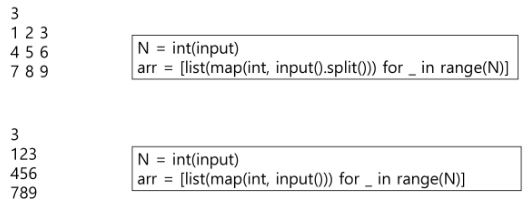

# 2. 배열 2(Array 2)

### 2차원 배열의 선언

- 1차원 List를 묶어놓은 List

- 2차원 이상의 다차원 List는 차원에 따라 Index를 선언

- 2차원 List의 선언 : 세로길이(행의 개수), 가로길이(열의 개수)를 필요로 함

- Python에서는 데이터 초기화를 통해 변수선언과 초기화가 가능함



배열 순회

n X m 배열의 n*m 개의 모든 원소를 빠짐없이 조사하는 방법

행 우선 순회

```python
# i행의 좌표
# j열의 좌표
for i int range(n):
    for j int range(m):
        Array[i][j] # 필요한 연산 수행
```

열 우선 순회

```python
# i행의 좌표
# j열의 좌표
for j int range(n):
    for i int range(m):
        Array[i][j] # 필요한 연산 수행
```

지그재그 순회

```python
# i행의 좌표
# j열의 좌표
for i int range(n):
    for j int range(m):
        Array[i][j + (m-1-2*j) * (i%2)] # 필요한 연산 수행
```

델타를 이용한 2차 배열 탐색

- 2차 배열의 한 좌표에서 4방향의 인접 배열 요소를 탐색하는 방법

```python
arr[0...N-1][0...N-1] # NxN 배열
di[] <- [0, 0, -1, 1] # 상하좌
dj[] <- [-1, 1, 0, 0]
for i : 0 -> N-1 :
    for j : 0 -> N-1 :
        for k in range(4) :
            ni <- i +di[k]
            nj <- j +dj[k]
            if 0 <= ni<N and 0<=nj<N # 유효한 인덱스
                    test(arr[ni][nj])
```


### 부분집합

##### 부분집합 합(Subset Sum) 문제

- 유한 개의 정수로 이루어진 집합이 있을 때, 이 집합의 부분집합 중에서 그 집합의 원소를 모두 더한 값이 0이 되는 경우가 있는지를 알아내는 문제

- 예를 들어 [-7, -3, -2, 5, 8]라는 집합이 있을 때, [-3, -2, 5]는 이 집합의 부분집합이면서 (-3)+(-2)+5=0이므로 이 경우의 답은 참

##### 부분집합 생성하기

- 완전검색 기법으로 부분집합 합 문제를 풀기 위해서는, 우선 집합의 모든 부분집합을 생성한 후에 각 부분집합의 합을 계산해야 함

- 주어진 집합의 부분집합을 생성하는 방법

- [ 부분집합의 수 ] - 집합의 원소가 n개일 때, 공집합을 포함한 부분집합의 수는 2^n개이다

- 이는 각 원소를 부분집합에 포함시키거나 포함시키지 않는 2가지 경우를 모든 원소에 적용한 경우의 수와 같다

- 각 원소가 부분집합에 포함되었는지를 loop 이용하여 확인하고 부분집합을 생성하는 방법

```python
bit = [0, 0, 0, 0]
for i in range(2):
    bit[0] = i
    for j in range(2):                        
        bit[1] = j
        for k in range(2):
            bit[2] = k
            for l in range(2):
                bit[3] = 1
                print_subset(bit)
```

##### 비트연산자

`&` : 비트 단위로 AND 연산

`|` : 비트 단위로 OR 연산

`<<` : 피연산자의 비트 열을 왼쪽으로 이동

`>>` : 피연산자의 비트 열을 오른쪽으로 이동

##### << 연산자

- 1 << n : 2^n 즉, 원소가 n개일 경우의 모든 부분집합의 수를 의미

##### & 연산자

- i & (1 << j) : i의 j번째 비트가 1인지 아닌지를 검사

```python
arr= [3, 6, 7, 1, 5, 4]
n= len(arr)                # n : 원소의 개
for i in range(1<<n):             # 1<<n : 부분 집합의 개수
    for j in range(n):            # 원소의 수만큼 비트를 비교                
        if i & (1<<j):            # i의 j번 비트가 1인경        
            print(arr[j], end=", ")        # j번 원소 출
    print()
print()
```
