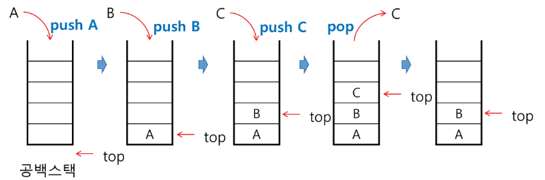

# Stack  스택1

#### 스택

스택의 특성

- 물건을 쌓아 올리듯 자료를 쌓아 올린 형태의 자료구조

- 스택에 저장된 자료는 선형 구조 가짐
  
  - 선형구조 : 자료 간의 관계가 1대1의 관계
  
  - 비선형구조 : 자료 간 관계가 1대 N의 관계

- 스택에 자료를 삽입하거나 스택에서 자료를 꺼낼 수 있음

- 마지막에 삽입한 자료를 가장 먼저 꺼낸다 - 후입선출(LIFO, Last-In-First-Out)
  
  - 예를 들어 스택에 1,2,3 순으로 자료를 삽입한 후 꺼내면 역순으로 꺼낼 수 있음


스택을 프로그램에서 구현하기 위해 필요한 자료구조와 연산

- 자료구조 : 자료를 선형으로 저장할 저장소
  
  - 배열 사용 가능
  
  - 저장소 자체를 스택이라 부르기도 함
  
  - 스택에서 마지막 삽입된 원소의 위치를 top이라 부름

- 연산
  
  - 삽입 : 저장소에 자료 저장 - 보통 push라 부름
  
  - 삭제 : 저장소에서 자료 꺼냄 - 꺼낸 자료는 삽입한 자료의 역순으로 꺼냄 보통 pop이라 부름
  
  - 스택이 공백인지 아닌지 확인하는 연산. isEmpty
  
  - 스택의 top에 있는 item(원소)을 반환하는 연산.peek

- 스택의 삽입/ 삭제 과정
  
  - 빈 스택에 원소 A,B,C를 차례로 삽입 후 한번 삭제하는 연산과정
  
  

- 스택의 push 알고리즘
  
  - append 메소드를 통해 리스트의 마지막에 데이터 삽입

```python
def push(item):
    s.append(item)
```


