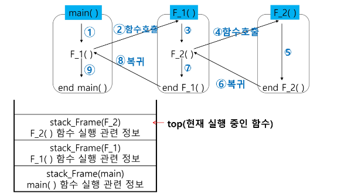
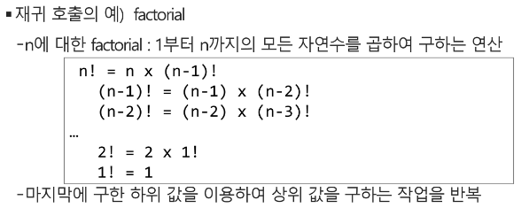
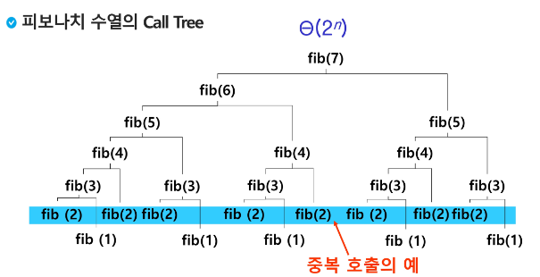

# Stack  스택2

#### 스택의 응용2 : function call

- function call
  
  - 프로그램에서의 함수 호출과 복귀에 따른 수행 순서를 관리
    
    - 가장 마지막에 호출된 함수가 가장 먼저 실행을 완료하고 복귀하는 후입선출 구조이므로 후입선출 구조의 스택 이용해 수행순서 관리
    
    - 함수 호출 발생하면 호출한 함수 수행에 필요한 지역변수, 매개변수 및 수행 후 복귀할 주소 등의 정보를 스택 프레임에 저장하여 시스템 스택에 삽입
    
    - 함수의 실행이 끝나면 시스템 스택의 top 원소(스택 프레임)를 삭제(pop)하면서 프레임에 저장되어 있던 복귀주소를 확인하고 복귀
    
    - 함수 호출과 복귀에 따라 이 과정을 반복하여 전체 프로그램 수행이 종료되면 시스템 스택은 공백 스택이 됨

<br>

- 함수 호출과 복귀에 따른 전체 프로그램의 수행 순서



<br>

#### 재귀호출

- 자기 자신을 호출하여 순환 수행되는 것

- 함수에서 실행해야 하는 작업의 특성에 따라 일반적인 호출방식보다 재귀호출방식을 사용하여 함수를 만들면 프로그램의 크기를 줄이고 간단하게 작성




- 0과 1로 시작하고 이전의 두 수 합을 다음 항으로 하는 수열을 피보나치라 함
  
  - 0, 1, 1, 2, 3, 5,8, 13,...

- 피보나치 수열의 i번 째 값을 계산하는 함수 F를 정의하면 다음과 같음
  
  - F0 = 0, F1= 1
  
  - Fi = Fi-1 + Fi-2 for i >= 2

- 위의 정의로부터 피보나치 수열의 i번째 항을 반환하는 함수를 재귀함수로 구현 가능

```python
def fibo(n):
    if n < 2:
        return n
    else:
        return fibo(n-1) + fibo(n-2)
```

<br>

#### Memorization (동적계획법 中 1)

- 앞의 예에서 피보나치 수를 구하는 함수를 재귀함수로 구현한 알고즘의 문제
  
  - "엄청난 중복 호출이 존재"



- **메모이제이션(memoization)** 은 컴퓨터 프로그램을 실행할 때 이전에 계산한 값을 메모리에 저장해서 매번 다시 계산하지 않도록 하여 전체적인 실행속도를 빠르게 하는 기술 - <u>동적 계획법</u>의 핵심이 되는 기술

- 탑- 다운 기술에서 사용

- 앞의 예에서 피보나치 수를 구하는 알고리즘에서 fibo(n)의 값을 계산하자마자 저장하면 실행시간을 O(n)으로 줄일 수 있다

```python
# memo를 위한 배열을 할당하고, 모두 0으로 초기화 한다;
# memo[0]을 0으로 memo[1]는 1로 초기화 한다;

def fibo1(n):
    global memo
    if n >= 2 amd memo[n] == 0:
        memo[n] = (fibo1(n-1) + fibo1(n-2))
    return memo[n]

memo = [0] * (n+1)
memo[0] = 0
memo[1] = 1  
```

<br>

#### DP(Dynamic Programming)

- 동적 계획(Dynamic Programming) 알고리즘은 그리디 알고리즘과 같이 최적화 문제를 해결하는 알고리즘

- 동적 계획 알고리즘은 먼저 입력 크기가 작은 부분 문제들을 모두 해결한 후에 그 해들을 이용하여 보다 큰 크기의 부분 문제들을 해결하여, 최종적으로 원래 주어진 입력의 문제를 해결하는 알고리즘 (바텀 업)

- 피보나치 수 DP 적용
  
  - 피보나치 수는 부분 문제의 답으로부터 본 문제의 답을 얻을 수 있으므로 최적 부분 구조로 이루어져 있음


<br>

#### DFS(깊이우선탐색)

- 비선형구조인 그래프 구조는 그래프로 표현된 모든 자료를 빠짐없이 검색하는 것이 중요
  
  - 깊이 우선 탐색(Depth First Search, DFS)
  
  - 너비 우선 탐색(Breadth First Search, BFS)

- 시작 정점의 한 방향으로 갈 수 있는 경로가 있는 곳까지 깊이 탐색해 가다가 더 이상 갈 곳이 없게 되면, 가장 마지막에 만났던 갈림길 간선이 있는 정점으로 되돌아와서 다른 방향의 정점으로 탐색을 계속 반복하여 결국 모든 정점을 방문하는 순회방법

- 가장 마지막에 만났던 갈림길의 정점으로 되돌아가서 다시 깊이 우선 탐색을 반복해야 하므로 후입선출 구조의 스택 사용


1) 시작 정점 v를 결정하여 방문

2) 정점 v에 인접한 정점 중에서
   
   1) 방문하지 않은 정점 w가 있으면, 정점 v를 스택에 push하여 정점 w 방문 그리고 w를 v로 하여 다시 2 반복
   
   2) 방문하지 않은 정점이 없으면, 탐색 방향을 바꾸기 위해 스택을 pop하여 받은 가장 마지막 방문 정점을 v로 하여 다시 2 반복

3) 스택이 공백이 될 때까지 2 반복


노드 

간선 : 노드끼리의 길이


