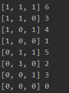

# stack2

#### 계산기1

- 문자열로 된 계산식이 주어질 때, 스택을 이용하여 이 계산식의 값을 계산 가능

- 문자열 수식 계산의 일반적 방법
  
  - 중위 표기법의 수식을 후위 표기법으로 변경 (스택이용)
  
  - 후위 표기법의 수식을 스택을 이용하여 계산

- step1. 중위표기식의 후위표기식 변환 방법1
  
  - 수식의 각 연산자에 대해 우선순위에 따라 괄호 사용하여 다시 표현
  
  - 각 연산자를 그에 대응하는 오른쪽 괄호의 뒤로 이동
  
  - 괄호 제거
  
  

- step1. 중위표기법에서 후위표기법으로의 변환 알고리즘(스택이용2)
  
  - 입력 받은 중위 표기식에서 토큰 읽음
  
  - 토큰이 피연산자이면 토큰 출력
  
  - 토큰이 연산자(괄호포함)일 때, 이 토큰이 스택의 top에 저장되어 있는 연산자보다 우선순위가 높으면 스택에 push하고. 그렇지 않다면 스택 top의 연산자의 우선순위가 토큰의 우선순위보다 작을 때까지 스택에서 pop한 후 토큰의 연산자를 push함 만약 top에  연산자 없으면 push
  
  - 토큰이 오른쪽 괄호')'이면 스택 top에 왼쪽 괄호'('가 올 때까지 스택에 pop 연산을 수행하고 pop한 연산자를 출력 - 왼쪽 괄호를 만나면 pop만 하고 출력하지는 않음
  
  - 중위 표기식에 더 읽을 것이 없다면 중지하고, 더 읽을 것이 있다면 1부터 다시 반복
  
  - 스택에 남아 있는 연산자를 모두 pop하여 출력
    
    - 스택 밖의 왼쪽 괄호는 우선 순위가 가장 높으며, 스택 안의 왼쪽 괄호는 우선순위가 가장 낮다

<br>

#### 계산기2

- step2. 후위 표기법의 수식을 스택 이용하여 계산
  
  1. 피연산자 만나면 스택에 push
  
  2. 연산자 만나면 필요한 만큼의 피연산자를 스택에서 pop하여 연산하고, 연산결과를 다시 스택에 push
  
  3. 수식 끝나면, 마지막으로 스택을 pop하여 출력

<br>

#### 백트래킹

- 백트래킹(Backtraking) 기법은 해를 찾는 도중에 '막히면' (즉, 해가 아니면) 되돌아가서 다시 해를 찾아 가는 기법 - 매 단계별로 선택 가능한 해를 골라서 순서대로 찾아가는 방법

- 백트래킹 기법은 최적화(optimization) 문제와 결정(decision) 문제를 해결할 수 있다

- 결정 문제 : 문제의 조건을 만족하는 해가 존재하는지의 여부를 'yes' 또는 'no'가 답하는 문제
  
  - 미로 찾기 / n-Queen 문제 / Map coloring / 부분 집합의 합 문제 등

<br>

- 미로찾기


- 백트래킹과 깊이우선탐색과의 차이
  
  - 어떤 노드에서 출발하는 경로가 해결책으로 이어질 것 같지 않으면 더 이상 그 경로를 따라가지 않음으로써 시도의 횟수를 줄임 (Pruning 가지치기)
  
  - 깊이우선탐색이 모든 경로를 추적하는데 비해 백트래킹은 불필요한 경로를 조기에 차단
  
  - 깊이우선탐색을 가하기에는 경우의 수가 너무나 많음. 즉 N! 가지의 경우의 수를 가진 문제에 대해 깊이우선탐색을 가하면 당연히 처리 불가능한 문제
  
  - 백트래킹 알고리즘을 적용하면 일반적으로 경우의 수가 줄어들지만 이 역시 최악의 경우에는 여전히 지수함수 시간을 요하므로 처리 불가능

- 백트래킹 기법
  
  - 어떤 노드의 유망성을 점검한 후에 유망(promising)하지 않다고 결정되면 그 노드의 부모로 되돌아가(backtracking) 다음 자식 노드로 감
  
  - 어떤 노드를 방문하였으 때 그 노드를 포함한 경로가 해답이 될 수 없으면 그 노드는 유망하지 않다고 하여, 반대로 해답의 가능성이 있으면 유망하다고 함
  
  - 가지치기(pruning) : 유망하지 않는 노드가 포함되는 경로는 더 이상 고려하지 않는다

- 백트래킹을 이용한 알고리즘은 다음과 같은 절차로 진행됨
  
  1. 상태 공간 트리의 깊이 우선 검색을 실시
  
  2. 각 노드가 유망한지 점검
  
  3. 만일 그 노드가 유망하지 않으면, 그 노드의 부모 노드로 돌아가서 검색 계속함

- 일반 백트래킹 알고리즘

```python
def checknode(v):    
    if promising(v):
        if there is a solution at v:
            write the solution
        else:
            for u in each child of v:
                checknode(u)
```

<br>

#### 부분집합 구하기

- 어떤 집합의 공집합과 자기자신을 포함한 모든 부분집합을 powerset이라고 하며 구하고자 하는 어떤 집합의 원소 개수가 n일 경우 부분집합의 개수는 2**n개 이다

- 백트래킹 기법으로 powerset을 구해보자
  
  - 앞에서 설명한 일반적인 백트래킹 방법 이용
  
  - n개의 원소가 들어있는 집합의 2**n개의 부분집합을 만들 때는, true 또는 false값을 가지는 항목들로 구성된 n개의 배열을 만드는 방법 이용
  
  - 여기서 배열의 i번째 항목은 i번째의 원소가 부분집합의 값인지 아닌지를 나타내는 값

- 각 원소가 부분집합에 포함되었는지를 loop 이용하여 확인하고 부분집합 생성하는 법

```python
# 부분집합의 원소 출력
def f(i, k):
    if i == k:
        for j in range(k):
            if bit[j]:
                print(A[j], end = ' ')
        # print()
        print(bit)
    else:
        bit[i] = 1
        f(i+1, k)
        bit[i] = 0
        f(i+1, k)

A = [1, 2, 3]
N = len(A)
bit = [0]*N
f(0,N)
```


```python
# 부분집합의 합 구하기
def f(i, k):
    if i == k:      # 하나의 부분집합 완성
        s = 0
        for j in range(k):
            if bit[j]:
                s += A[j]   # 부분집합의 합
        print(bit , s)

    else:
        bit[i] = 1
        f(i+1, k)
        bit[i] = 0
        f(i+1, k)

A = [1, 2, 3]
N = len(A)
bit = [0]*N
f(0, N)
```



```python
# 원소의 합이 10인 부분집합
def f(i, k, key):
    if i == k:  # 하나의 부분집합 완성
        s = 0
        for j in range(k):
            if bit[j]:
                s += A[j]  # 부분집합의 합
        if s == key:    # 합이 key와 같은 부분집합을 출력
            for j in range(k):
                if bit[j]:
                    print(A[j], end=' ')
            print()

    else:
        bit[i] = 1
        f(i + 1, k, key)
        bit[i] = 0
        f(i + 1, k, key)


A = [1, 2, 3, 4, 5, 6, 7, 8, 9, 10]
N = len(A)
bit = [0] * N
f(0, N, 10)
```


```python
def f(i, k, s, t):   # i원소. k집합의 크기, s i-1까지 고려된 합, t 목표
    global cnt
    if i == k:
        if s == t:
            cnt += 1
        return
    else:
        f(i+1, k, s+A[i], t)    # A[i] 포함
        f(i+1, k, s, t)         # A[i] 미포함


A = [1, 2, 3, 4, 5, 6, 7, 8, 9, 10]
N = len(A)
key = 10
cnt = 0
bit = [0] * N

f(0, N, 0, key)
print(cnt)          # 합이 key인 부분집합의 수
```

```python
def f(i, k, s, t):   # i원소. k집합의 크기, s i-1까지 고려된 합, t 목표
    global cnt
    if i == k:
        if s == t:
            for j in range(k):
                if bit[j]:
                    print(A[j], end=' ')
            print()
            cnt += 1
        return
    else:
        bit[i] = 1
        f(i+1, k, s+A[i], t)    # A[i] 포함
        bit[i] = 0
        f(i+1, k, s, t)         # A[i] 미포함


A = [1, 2, 3, 4, 5, 6, 7, 8, 9, 10]
N = len(A)
key = 10
cnt = 0
bit = [0] * N

f(0, N, 0, key)
print(cnt)          # 합이 key인 부분집합의 수
```

함수 호출횟수까지 알 필요가 있나..?

global fcnt / fcnt += 1 / print(cnt, fcnt)로 확인 가능

ex) 10 일때 -> 10 2047

```python
def f(i, k, s, t):   # i원소. k집합의 크기, s i-1까지 고려된 합, t 목표
    global cnt
    global fcnt
    fcnt += 1
    if s > t:   # 고려한 원소의 합이 찾는 합보다 큰 경우
        return
    if i == k:
        if s == t:
            cnt += 1
        return
    else:
        bit[i] = 1
        f(i+1, k, s+A[i], t)    # A[i] 포함
        bit[i] = 0
        f(i+1, k, s, t)         # A[i] 미포함


N = 10
A = [i for i in range(1, N+1)]
key = 10
cnt = 0
bit = [0] * N
fcnt = 0    # 함수 호출 횟수
f(0, N, 0, key)
print(cnt, fcnt)          # 합이 key인 부분집합의 수
```

10일 때 -> 10 415로 함수 호출 횟수가 줄어듬


#### 순열

#### 분할 정복 알고리즘

- 설계 전략
  
  - 분할(Divide) : 해결할 문제를 여러 개의 작은 부분으로 나눈다
  
  - 정복(Conquer) : 나눈 작은 문제를 각각 해결
  
  - 통합(Combine) :(필요하다면) 해결된 해답을 모은다

- 거듭제곱 (Exponentiation)


- 분할 정복 기반의 알고리즘 : O(log2n) (거듭제곱 예시)

```python
def power(Base, Exponent):
    if Exponent == 0 or Base == 0:
        return 1
    
    if Exponent % 2 == 0:
        NewBase = power(Base, Exponent/2)
        return NewBase * NewBase
    
    else:
        NewBase = power(Base, (Exponent-1)/2)
        return (NewBase * NewBase) * Base
```

##### 퀵 정렬

- 주어진 배열을 두 개로 분할 하고 각각을 정렬

- 다른 점1 : 합병정렬은 그냥 두 부분으로 나누는 반면, 퀵정렬은 분할할 때, 기준 아이템 중심으로 이보다 작은 것은 왼편, 큰 것은 오른편에 위치

- 다른 점2: 각 부분 정렬이 끝난 후, 합병정렬은 "합병"이란 후처리 작업 필요하나, 퀵정렬은 필요 없음

```python
def quickSort(a, begin, end):
    if begin < end:
        p = partition(a, begin, end)
        quickSort(a, begin, p-1)
        quickSort(a, p+1, end)
```

```python
def quickSort(a, begin, end):
    pivot = (begin + end) // 2
    L = begin
    R = end
    while L < R:
        while (L<R and a[L] < a[pivot]): L += 1
        while (L<R and a[R] >= a[pivot]): R -= 1
        if L < R:
            if L == pivot : pivot = R
            a[L], a[R] = a[R], a[L]
    a[pivot], a[R] = a[R], a[pivot]
    return R
```

- 수행과정
  
  - ex) { 69, 10, 30, 2, 16, 8, 31, 22}
  
  - 원소의 개수가 8개이므로 네 번째 자리에 있는 원소 2를 첫번째 피봇으로 선택하고 퀵 정렬 시작
  
  
  
  1. 원소 2를 피봇으로 선택하고 퀵 정렬 시작
  
  
  
  2. 피봇 2의 왼쪽 부분 집합은 공집합이므로 퀵 정렬을 수행하지 않고, 오른쪽 부분 집합에 대해서 퀵 정렬 수행
  
  
  
  
  
  3. 피봇 16의 왼쪽 부분 집합에서 원소 10을 피봇으로 선택하여 퀵 정렬 수행
  
  
  
  4. 피봇 10의 확정된 위치에서의 왼쪽 부분 집합은 원소가 한 개이므로 퀵 정렬을 수행하지 않고, 오른쪽 부분 집합은 공집합이므로 역시 퀵 정렬을 수행하지 않는다
  
  
  
  
  
  5. 피봇 30의 확정된 위치에서의 왼쪽 부분 집합의 원소가 한 개 이므로 퀵 정렬을 수행하지 않고, 오른쪽 부분 집합에 대해서 퀵 정렬 수행
  
  
  
  
  
  

    
