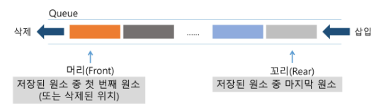
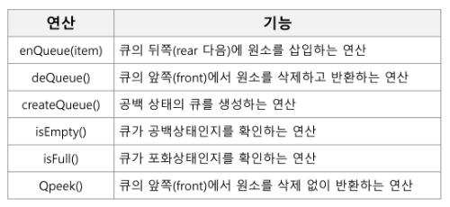
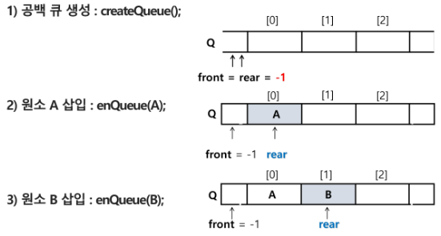
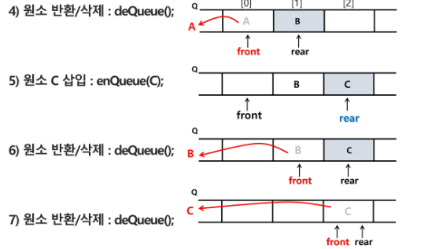

# 큐 Queue

- 큐의 특성
  
  - 스택과 마찬가지로 삽입과 삭제의 위치가 제한적인 자료구조
    
    - 큐의 뒤에서는 삽입만 하고, 큐의 앞에서는 삭제만 이루어지는 구조
  
  - 선입선출구조(FIFO : First In First Out)
    
    - 큐에 삽입된 순서대로 원소가 저장되어, 가장 먼저 삽입(First In)된 원소는 가장 먼저 삭제(First Out)된다

- 큐의 선입선출구조



- 큐의 기본 연산







front = 디큐 위치 rear = 인큐 위치 ---> 기본적인 위치는 -1로 지정

- 선형큐
  
  - 1차원 배열을 이용한 큐
    
    - 큐의 크기 = 배열의 크기
    
    - front : 저장된 첫 번째 원소의 인덱스
    
    - rear : 저장된 마지막 원소의 인덱스
  
  - 상태 표현
    
    - 초기 상태 : front = rear = -1 (큐가 비어있는 상태)
    
    - 공백 상태 : front == rear
    
    - 포화 상태 : rear == n-1(n: 배열의 크기, n-1: 배열의 마지막 인덱스)

- 초기 공백 큐 생성
  
  - 크기 n인 1차원 배열 생성
  
  - front와 rear를 -1로 초기화

- 삽입 : enQueue(item)
  
  - 마지막 원소 뒤에 새로운 원소를 삽입하기 위해
    
    1) rear 값을 하나 증가시켜 새로운 원소를 삽입할 자리를 마련
    
    2) 그 인덱스에 해당하는 배열원소 Q[rear]에 item을 저장
    
    ```python
    def enQueue(item):
        global rear
        if isFull() : print("Queue_Full")
        else:
            rear <- rear + 1;
            Q[rear] <- item;
    ```

- 삭제 : deQueue() - double ended Queue
  
  - 가장 앞에 있는 원소를 삭제하기 위해
    
    1. front 값을 하나 증가시켜 큐에 남아있게 될 첫 번째 원소 이동
    
    2. 새로운 첫 번째 원소를 리턴 함으로써 삭제와 동일한 기능함
    
    ```python
    deQueue()
        if(isEmpty()) then Queue_Empty();
        else{
            front <- front + 1;
            return Q[front];
        }
    ```

- 공백상태 및 포화상태 검사 : isEmpty(), isFull()
  
  - 공백상태 : front == rear
  
  - 포화상태 : rear == n-1 (n : 배열의 크기, n-1: 배열의 마지막 인덱스)
  
  ```python
  def isEmpty():
      return front == rear
  def Full():
      return rear == len(Q) -1
  ```

- 검색 : Qpeek()
  
  - 가장 앞에 있는 원소를 검색하여 반환하는 연산
  
  - 현재 front의 한자리 뒤 (front+1)에 있는 원소, 즉 큐의 첫 번째에 있는 원소를 반환
  
  ```python
  def Qpeek():
      if isEmpty() : print("Queue_Empty")
      else : return Q[front+1]
  ```


##### 선형 큐 이용시의 문제점

-  잘못된 포화상태 인식
  
  - 선형 큐를 이용하여 원소의 삽입과 삭제를 계속할 경우, 배열의 앞부분에 활용할 수 있는 공간이 있음에도 불구하고,  rear = n-1 인 상태 즉, 포화상태로 인식하여 더 이상의 삽입을 수행하지 않게 됨

- 해결방법1
  
  - 매 연산이 이루어질 때마다 저장된 원소들을 배열의 앞부분으로 모두 이동시킴
  
  - 원소 이동에 많은 시간이 소요되어 큐의 효율성이 급격히 떨어짐

- 해결방법2
  
  - 1차원 배열을 사용하되, 논리적으로는 배열의 처음과 끝이 연결되어 원형 형태의 큐를 이룬다고 가정하고 사용

##### 원형 큐의 구조

- 초기 공백 상태
  
  - front = rear = 0

- Index의 순환
  
  - front와 rear의 위치가 배열의 마지막 인덱스인 n-1를 가리킨 후, 그 다음에는 논리적 순환을 이루어 배열의 처음 인덱스인 0으로 이동해야 함
  
  - 이를 위해 나머지 연산자 mod 사용

- front 변수
  
  - 공백 상태와 포화 상태 구분을 쉽게 하기 위해 front가 있는 자리는 사용하지 않고 항상 빈자리로 둠

- 삽입 위치 및 삭제 위치

|     | 삽입 위치                   | 삭제 위치                     |
|:---:|:-----------------------:|:-------------------------:|
| 선형큐 | rear = rear + 1         | front = front + 1         |
| 원형큐 | rear = (rear + 1) mod n | front = (front + 1) mod n |


