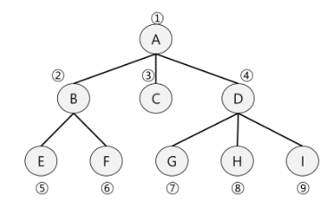

# QUEUE2

##### 큐의 활용 : 버퍼(Buffer)

- 버퍼
  
  - 데이터를 한 곳에서 다른 한 곳으로 전송하는동안 일시적으로 그 데이터를 보관하는 메모리의 영역
  
  - 버퍼링 : 버퍼를 활용하는 방식 또는 버퍼를 채우는 동작을 의미

- 버퍼의 자료 구조
  
  - 버퍼는 일반적으로 입출력 및 네트워크와 관련된 기능에서 이용
  
  - 순서대로 입력/ 출력/ 전달되어야 하므로 FIFO 방식의 자료구조인 큐가 활용

<br>

##### BFS(Breadth First Search)

- 그래프를 탐색하는 방법에는 크게 두 가지
  
  - 깊이 우선 탐색(DFS)
  
  - 너비 우선 탐색(BFS)

- 너비우선탐색은 탐색 시작점의 인접한 정점들을 먼저 모두 차례로 방문한 후에, 방문했던 정점을 시작점으로 하여 다시 인접한 정점들을 차례로 방문하는 방식

- 인접한 정점들에 대해 탐색을 한 후, 차례로 다시 너비우선탐색을 진행해야 하므로, 선입선출 형태의 자료구조인 큐를 활용



- 입력 파라미터 : 그래프 G와 탐색 시작점 

```python
def BFS(G, v):      # 그래프 G, 탐색 시작점 v
    visited = [0*(n+1)]     # n : 정점의 개수
    queue = []              # 큐 생성
    queue.append(v)         # 시작점 v를 큐에 삽입
    while queue:            # 큐가 비어있지 않은 경우
        t = queue.pop(0)        # 큐의 첫번째 원소 반환
        if not visited[t]:      # 방문되지 않은 곳이라면
            visited[t] = True       # 방문한 것으로 표시
            visit(t)                # 정점 t에서 할 일
            for i in G[t]:          # t와 연결된 모든 정점에 대해
                if not visited[i]:      # 방문되지 않은 곳이라면
                    queue.append(i)         # 큐에 넣기
```


