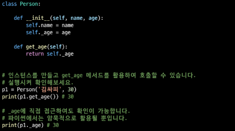
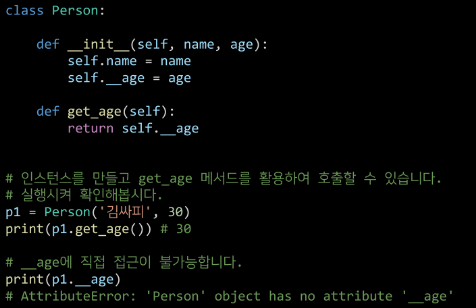

## 객체 지향의 핵심 개념

> ##### 추상화 : 핵심이 되는 부분만 추리기

- 현실 세계를 프로그램 설계에 반영
  
  - 복잡한 것은 숨기고, 필요한 것만 드러내기

<br>

> ##### 상속 : 코드의 재사용성을 높이고 기능을 확장

- 상속이란
  
  - 두 클래스 사이 부모-자식 관계를 정립하는 것

- 클래스는 상속이 가능함

` class ChildClass(ParentClass): `

- 하위 클래스는 상위 클래스에 정의된 속성, 행동, 관계 및 제약 조건을 모두 상속 받음

- 부모 클래스의 속성, 메서드가 자기 클래스에 상속되므로, 코드 재사용성이 높아짐

<br>

    -- 상속 관련 함수와 메서드

- isinstance(object, classinfo)
  
  - classinfo의 instance거나 subclass*인 경우 True

- issubclass(class,classinfo)
  
  - class가 classinfo의 subclass면 True
  
  - classinfo의 모든 항목을 검사

- super()
  
  - 자식클래스에서 부모클래스를 사용하고 싶은 경우

- mro메서드 (Method Resolution Order)
  
  - 해당 인스턴스의 클래스가 어떤 부모 클래스를 가지는지 확인하는 메서드
  
  - 기존의 인스턴스 -> 클래스 순으로 이름 공간을 탐색하는 과정에서 상속 관계에 있으면 인스턴스 -> 자식 클래스 -> 부모 클래스로 확장

<br>

    -- 정리

- 파이썬의 모든 클래스는 object로부터 상속됨

- 부모 클래스의 모든 요소(속성, 메서드)가 상속됨

- super()를 통해 부모 클래스의 요소를 호출할 수 있음

- 메서드 오버라이딩을 통해 자식 클래스에서 재정의 가능함

- 상속관계에서의 이름 공간은 인스턴스, 자식 클래스, 부모 클래스 순의로 탐색

<br>

    -- 다중 상속

- 두 개 이상의 클래스를 상속 받는 경우

- 상속받은 모든 클래스의 요소를 활용 가능함

- 중복된 속성이나 메서드가 있는 경우 상속 순서에 의해 결정됨

  <br>

> ##### 다형성 : 각자의 특성에 따라 다른 결과 만들기

- 다형성(Polymorphism)이란 ? 
  
  - 여러 모양을 뜻하는 그리스어
  
  - 동일한 메서드가 클래스에 따라 다르게 행동할 수 있음을 의미
  
  - 즉, 서로 다른 클래스에 속해있는 객체들이 <u>동일한 메시지에 대해 다른 방식으로 응답할 수 있음</u>

<br>

    -- 메서드 오버라이딩

- 상속받은 메서드를 재정의
  
  - 클래스 상속 시, 부모 클래스에서 정의한 메서드를 자식 클래스에서 변경
  
  - 부모 클래스의 메서드 이름과 기본 기능은 그대로 사용하지만, 특정 기능을 바꾸고 싶을 때 사용
  
  - 상속받은 클래스에서 같은 이름의 메서드로 덮어씀
  
  - 부모 클래스의 메서드를 실행시키고 싶은 경우 super를 활용

<br>

> ##### 캡슐화 : 데이터 보호하기

- 객체의 일부 구현 내용에 대해 외부로부터의 직접적인 액세스를 차단
  
  - ex) 주민등록번호

- 파이썬에서 암묵적으로 존재하지만, 언어적으로는 존재하지 않음

<br>

    -- 접근 제어자 종류

- Public Access Modifier : 모두 가능

- Protected Access Modifier : 상속 관계에서만 가능

- Private Access Modifier : 나만 가능

<br>

    -- **Public Member**

- 언더바 없이 시작하는 메서드나 속성

- 어디서나 호출 가능, 하위 클래스 override 허용

- 일반적으로 작성되는 메서드와 속성의 대다수를 차지

<br>

    -- **Protected Member**

- 언더바 1개로 시작하는 메서드나 속성

- 암묵적 규칙에 의해 부모 클래스 내부와 자식 클래스에서만 호출 가능

- 하위 클래스 override 허용



<br>

    -- **Private Member**

- 언더바 2개로 시작하는 메서드나 속성

- 본 클래스 내부에서만 사용이 가능

- 하위클래스 상속 및 호출 불가능(오류)

- 외부 호출 불가능(오류)



<br>

    -- **getter 메서드와 setter 메서드**

- 변수에 접근할 수 있는 메서드를 별도로 생성
  
  - getter 메서드 : 변수의 값을 읽는 메서드
    
    - @property 데코레이터 사용
  
  - setter 메서드 : 변수의 값을 설정하는 성격의 메서드
    
    - @변수.setter 사용

<br>

<br>

## 에러와 예외처리

### 디버깅

> ##### 버그란?

- 소프트웨어에서 발생하는 문제를 버그라 부름

> ##### 디버깅의 정의

- 잘못된 프로그램을 수정하는 것을 디버깅이라함 de(없앤다) + bugging(버그)

- 에러 메시지가 발생하는 경우
  
  - 해당하는 위치를 찾아 메시지를 해결

- 로직 에러가 발생하는 경우
  
  - 명시적인 에러 메시지 없이 예상과 다른 결과가 나오 경우
    
    - 정상적으로 동작하였던 코드 이후 작성된 코드를 생각해봄
    
    - 전체 코드를 살펴봄 / 누군가에게 설명.. / ...

<br>

### 에러와 예외

> ##### 문법 에러(Syntax Error)

- SyntaxError가 발생하면, 파이썬 프로그램은 실행이 되지 않음

- 파일이름, 줄번호, ^ 문자를 통해 파이썬이 코드를 읽어 나갈 때 (parser)문제가 발생한 위치를 표현

- 줄에서 에러가 감지된 가장 앞의 위치를 가리키는 캐럿 기호 ^를 표시

` Invalid syntax - 문법 오류`    `assign to literal 잘못된 할당`

`EOL (End of Line)` `EOF(End of File)` 

> ##### 예외(Exception)

- 실행 도중 예상치 못한 상황을 맞이하면, 프로그램 실행을 멈춤
  
  - 문장이나 표현식이 문법적으로 올바르더라도 발생하는 에러

- 실행 중에 감지되는 에러들을 예외라고 부름

- 예외는 여러 타입으로 나타나고 타입이 메시지의 일부로 출력됨
  
  - NameError, TypeError 등은 발생한 예외 타입의 종류(이름)

- 모든 내장 예외는 Exception Class를 상속받아 이뤄짐

- 사용자 정의 예외를 만들어 관리할 수 있음

`ZeroDivisionError - 10/0` `NameError - print(name_error)`

`TypeError - 타입 불일치 / argument누락 / argument 개수초과 / argument type 불일치`

`ValueError - 타입은 올바르나 값이 적절하지 않거나 없는 경우` 

`IndexError - 인덱스가 존재하지 않거나 범위를 벗어나는 경우` 

`KeyError - 해당 키가 존재하지 않는 경우` 등등

> ##### 예외처리

- try문(statement) / except 절(clause)을 이용하여 예외 처리를 할 수 있음

- try문
  
  - 오류가 발생할 가능성이 있는 코드를 실행
  
  - 예외가 발생되지 않으면, except 없이 코드 종료

- except문
  
  - 예외가 발생하면, except 절이 실행
  
  - 예외 상황을 처리하는 코드를 받아서 적절한 조치를 취함

```python
try:
    num = input('숫자입력: ')
    print(int(num))
except ValueError:
    print('숫자가 입력되지 않았습니다')

else:
    else 명령        
```

> ##### 에러 메시지 처리(as)

- as 키워드를 활용하여 원본 에러 메시지를 사용할 수 있음
  
  - 예외를 다른 이름에 대입
