# Web

> **웹사이트**

웹 사이트란 웹 브라우저를 통해 접속하는 웹 페이지들의 모음

-> 링크를 통해 여러 웹 페이지를 연결한 것

> **웹 페이지의 구성요소**

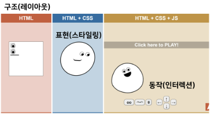

## <mark>HTML</mark>

<u>**Hyper Text**</u> Markup Language

: 참조 (하이퍼링크)를 통해 사용자가 한 문서에서 다른 문서로 즉시 접근할 수 있는 텍스트

Hyper Text <u>**Markup Language**</u>

: 태그 등을 이용하여 문서나 데이터의 구조를 명시하는 언어

    대표적인 예 - HTML, Markdown 

** 웹 페이지를 작성(구조화)하기 위한 언어 **

<mark>MDN / W3Schools</mark>

 

> **기본 구조**

- html :  문서의 최상위(root) 요소

- head : 문서 메타데이터 요소
  
  - 문서 제목, 인코딩, 스타일, 외부 파일 로딩 등
  
  - 일반적으로 브라우저에 나타나지 않는 내용

- body : 문서 본문 요소
  
  - 실제 화면 구성과 관련된 내용

> **Head 예시**

- <title> : 브라우저 상단 타이틀

- <link> : 외부 리소스 연결 요소 (CSS 파일 등)

- <style> : CSS 직접 작성

> **요소(element)**

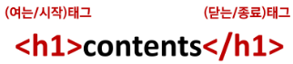

HTML의 요소는 태그와 내용(contents)으로 구성되어 있다

- HTML 요소는 시작 태그와 종료 태그 그리고 태그 사이에 위치한 내용으로 구성
  
  - 태그(Element, 요소)는 컨텐츠(내용)을 감싸는 것으로 그 정보의 성격과 의미를 정의

- 내용이 없는 태그들
  
  - br, hr, img, input, link, meta

- 요소는 중첩(nested)될 수 있음
  
  - 요소의 중첩을 통해 하나의 문서를 구조화
  
  - 여는 태그와 닫는 태그의 쌍을 잘 확인해야 함
    
    - 오류를 반환하는 것이 아닌 그냥 레이아웃이 깨진 상태로 출력되기 때문에, 디버깅이 힘들어질 수 있음

> **속성(attribute)**

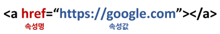

각 태그별로 사용할 수 있는 속성이 다르다

속성은 속성명과 속성값으로 이루어져 있다

- 속성을 통해 태그의 부가적인 정보를 설정할 수 있음

- 요소는 속성을 가질 수 있으며, 경로나 크기와 같은 추가적인 정보를 제공

- 요소의 시작 태그에 작성하며 보통 이름과 값이 하나의 쌍으로 존재

- 태그와 상관없이 사용 가능한 속성(HTML Global Attribute)들도 있음

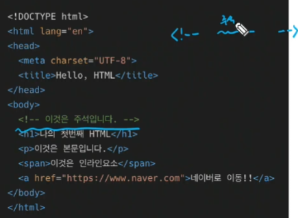

> **HTML 문서 구조화**

- 텍스트 요소

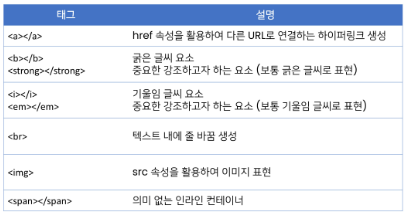

- 그룹 컨텐츠

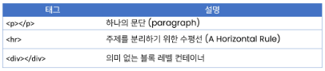

- form
  
  - <form>은 사용자의 정보(데이터)를 제출하기 위한 영역

- input
  
  - 다양한 타입을 가지는 입력 데이터 유형과 위젯이 제공됨

- input label
  
  - label을 클릭하여 input 자체의 초점을 맞추거나 활성화 시킬 수 있음
    
    - 사용자는 선택할 수 있는 영역이 늘어나 웹/ 모바일(터치)환경에서 편하게 사용할 수 있음
    
    - label과  input 입력의 관계가 시각적 뿐만 아니라 화면리더기에서도 label을 읽어 쉽게 내용을 확인할 수 있도록 함
  
  - <mark><input>에 id 속성을, <label>에는 for 속성</mark>을 활용하여 상호연관을 시킴

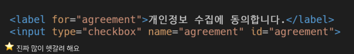

- input 유형 - 일반
  
  - 일반적으로 입력을 받기 위하여 제공되며 type으로 HTML기본 검증 혹은 추가 속성을 활용할 수 있음
    
    - text : 일반 텍스트 입력
    
    - password : 입력 시 값이 보이지 않고 문자를 특수기호(*) 로 표시
    
    - email : 이메일 형식이 아닌 경우 form 제출불가 
    
    - number : min, max, step 속성을 활용하여 숫자 범위 설정 가능
    
    - file : accept 속성을 활용하여 파일 타입 지정 가능

- input 유형 - 항목 중 선택
  
  - label로 선택에 대한 내용을 작성하고, 항목으로 선택할 수 있는 input을 제공
  
  - 동일한 범주에 속하는 항목들은 name을 통일하고, 선택된 항목의 값은 value로 지정함
    
    - checkbox : 다중 선택
    
    - radio : 단일 선택

- input 유형 - 종합
  
  - <input> 요소의 동작은 type에 따라 달라지므로, 각각의 내용을 숙지할 것

## <mark>CSS</mark>

Cascading Style Sheets

스타일을 지정하기 위한 언어 : 선택하고, 스타일을 지정한다

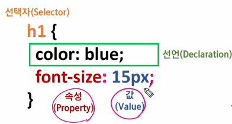

- CSS 구문은 선택자를 통해 스타일을 지정할 HTML 요소를 선택

- 중괄호 안에서는 속성과 값, 하나의 쌍을 이루어진 선언을 진행

- 각 쌍은 선택한 요소의 속성, 속성에 부여할 값을 의미
  
  - 속성 (Property) : 어떤 스타일 기능을 변경할지 결정
  
  - 값 (Value) : 어떻게 스타일 기능을 변경할지 결정

> **CSS 정의 방법**

- 인라인 (inline)

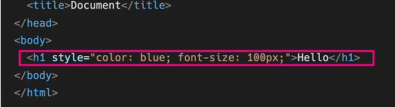

- 내부참조(embedding) - <style>

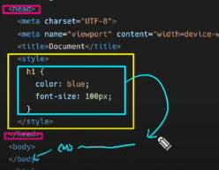

- 외부참조(link file) - 분리된 CSS 파일

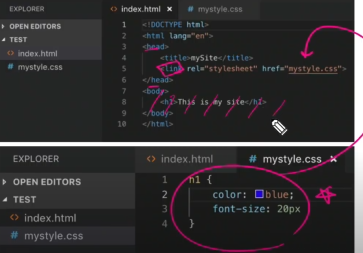

### CSS Selectors

> **선택자 유형**

- 기본 선택자
  
  - 전체 선택자(*), 요소(tag) 선택자
  
  - 클래스(class) 선택자, 아이디(id) 선택자, 속성(attr) 선택자

- 결합자(Combinators)
  
  - 자손 결합자, 자식 결합자

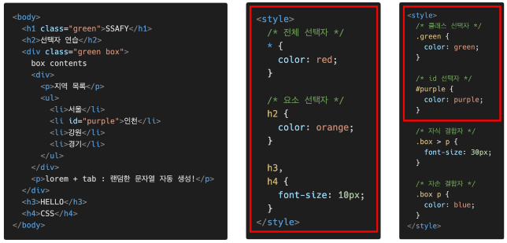

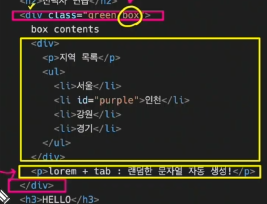

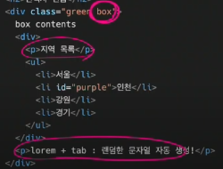

자식 - 자손 구분

** 클래스와 아이디 차이 : 클래스는 여러번 쓸 거 일 때

- 요소 선택자
  
  - HTML 태그를 직접 선택

- 클래스(class) 선택자
  
  - 마침표(.) 문자로 시작하며, 해당 클래스가 적용된 항목을 선택

- 아이디(id) 선택자
  
  - `#`문자로 시작하며, 해당 아이디가 적용된 항목을 선택
  
  - 일반적으로 하나의 문서에 1번만 사용. 여러 번 사용해도 동작하지만, 단일 id 를 사용하는 것을 권장

>  **CSS 적용 우선순위 (cascading order)**

- CSS우선순위를 아래와 같이 그룹을 지어볼 수 있다
  
  1. 중요도(Importance) - 사용시 주의
     
     - important
  
  2. 우선 순위(Specificity)
     
     - 인라인 > id > class, 속성 > 요소

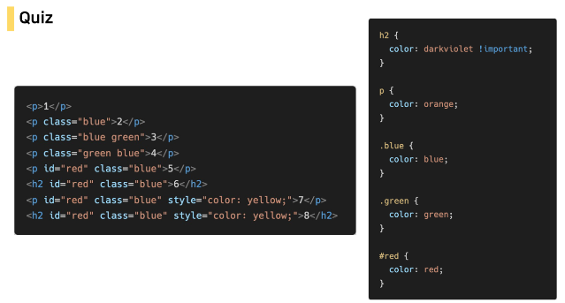

orange - blue - <mark>green</mark> - <mark>green</mark> - red - darkviolet - yellow - darkviolet

-> css에서 green이 뒤에 있는거 주의

> **CSS 상속**

- CSS는 상속을 통해 부모 요소의 속성을 자식에게 상속
  
  - 속성(프로퍼티) 중에는 상속이 되는 것과 되지 않는 것들이 있다

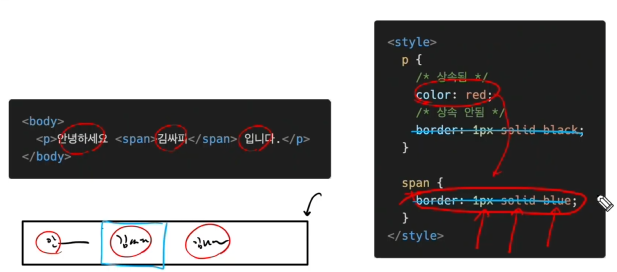

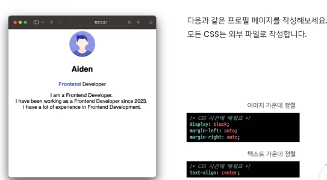

해보기

+ 콤보박스 정리
  
  특정한 값 하나를 기본값(default)으로 지정하고 싶으면 <option> 태그에 'selected'
  
  콤보박스 비활성화 : <select> 태그에 'disabled'
  
  특정항목 비활성화 : <option> 태그에 'disabled'
  
  특정항목 안보이게 : <option> 태그에 'hidden'
  
  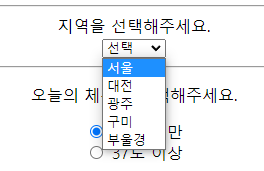 

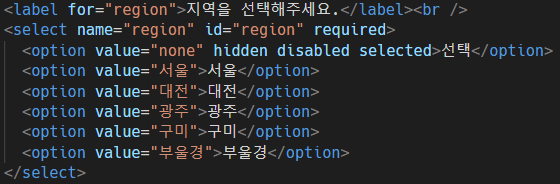

required : 유효성 검사 - 하나 이상의 옵션을 선택하지 않으면 form 제출 불가

- 라디오버튼 정리
  
  
