# CSS

## CSS Box model

모든 요소는 네모(박스모델)이고, 위에서부터 아래로, 왼쪽에서 오른쪽으로 쌓인다

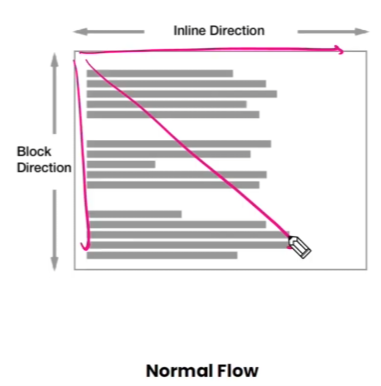

하나의 박스는 네 부분(영역)으로 이루어짐

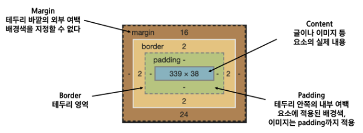

- margin / padding / border / 

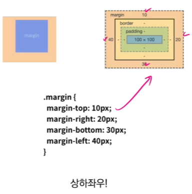

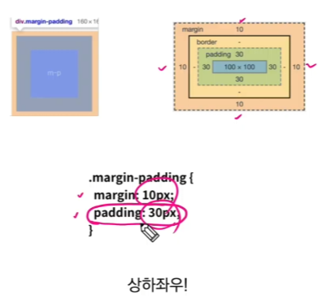

한 개만 적어놔도 상하좌우 동일하게 주는 것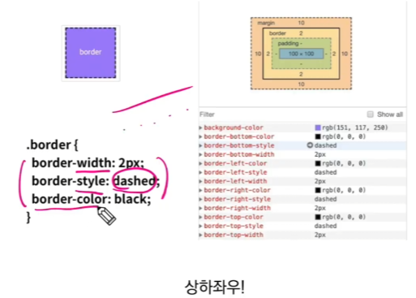

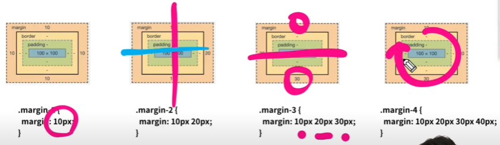

**margin / padding ::: shorthand를 통해서 표현이 가능하다**

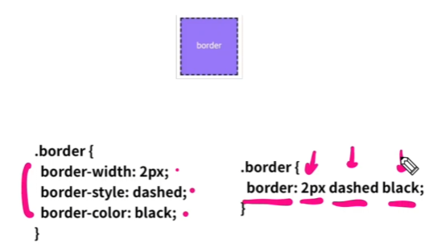

**border도 shorthand가 있다**

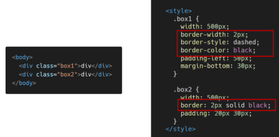

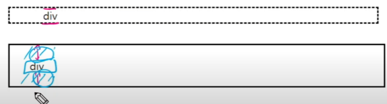

padding이 있어 구간이 넓어짐

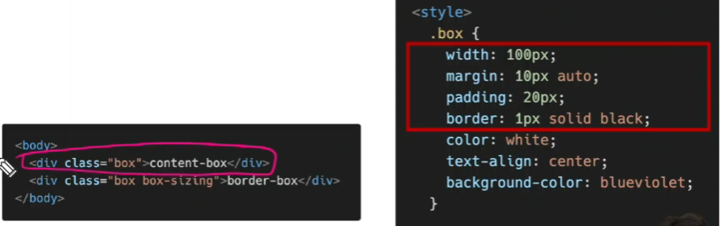

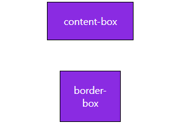

content-box의 너비는 얼마인가? -->142 정도 --> 내가 원하는건 100px

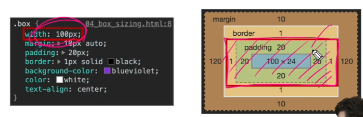

> box - sizing

- 기본적으로 모든 요소의 box-sizing은 content-box
  
  - Padding을 제외한 순수 contents 영역만을 box로 지정

- 다만 우리가 일반적으로 영역을 볼 때는 border까지의 너비를 100px 보는 것을 원함
  
  - 그 경우 box-sizing을 border-box으로 설정

## 개발자 도구

> 크롬 개발자 도구

- 웹 브라우저 크롬에서 제공하는 개발과 관련된 다양한 기능을 제공

- 주요 기능
  
  - Elements - DOM 탐색 및 CSS 확인 및 변경
    
    - Styles - 요소에 적용된 CSS 확인
    
    - Computed - 스타일이 계산된 최종 결과
    
    - Event Listeners - 해당 요소에 적용된 이벤트(JS)
  
  - Sources, Network, Performance, Application, Security, Audits 등

<참고>

div.content 하고 탭 -> class

div#my 하고 탭 -> id

div.my-content*5 하고 탭-> 5개 class 동시에

div.my-content>p#test*5

> CSS 원칙

<u>**display에 따라 크기와 배치가 달라진다**</u>

- 인라인 / <u>블록요소</u>

한 줄을 다 차지하는 것 ex) div 태그

div 두개 쓰면 한줄 다 차지하니까 밑으로 내려감

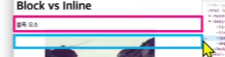

줄 바꿈이 일어나는 요소(다른 elem를 밀어낸다!)

화면 크기 전체의 가로 폭을 차지

블록 레벨 요소 안에 인라인 레벨 요소가 들어갈 수 있음

- <u>인라인</u> /블록요소

딱 컨텐트 높이 너비까지만 차지 ex) span태그

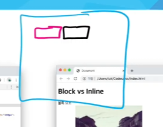

줄 바꿈이 일어나지 않는 행의 일부 요소

content를 마크업하고 있는 만큼만 가로 폭을 차지

width, height, margin-top, margin-bottom을 지정할 수 없음

~~상하 여백은 line-height로 지정~~

 

> 블록 레벨 요소와 인라인 레벨 요소

- 대표적인 블록 레벨
  
  - div / ul, ol, li, p / hr / form 등

- 대표적인 인라인 레벨 요소
  
  - span / a / img / input, label / b, em, i, strong 등

> block

> inline

> 속성에 따른 수평 정렬

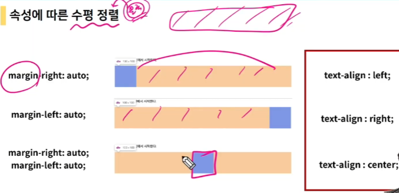

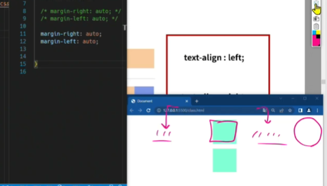

> inline-block

block 과 inline 레벨 요소의 특징을 모두 가짐

inline처럼 한 줄에 표시 가능하고, block처럼 width, height, margin 속성을 모두 지정가능

> none

해당 요소를 화면에 표시하지 않고, 공간조차 부여되지 않음

이와 비슷한 visibility: hidden은 해당 요소가 공간은 차지하나 화면에 표시 안함

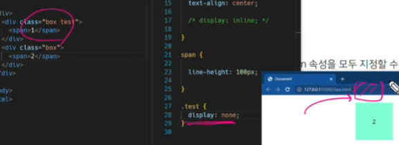

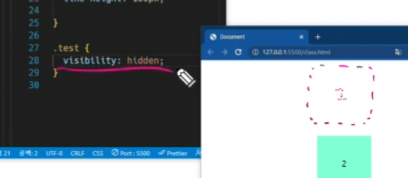

## CSS Position

- 문서 상에서 요소의 위치를 지정
  
  - static  : 모든 태그의 기본 값(기준 위치)
  
  - relative : 상대 위치
    
    - 자기 자신의 static 위치를 기준으로 이동(normal flow유지)
    
    - 레이아웃에서 요소가 차지하는 공간은 static일 때와 같음(normal position 대비 offset)
  
  - absolute : 절대 위치
    
    - 요소를 일반적인 문서 흐름에서 제거 후 레이아웃에 공간을 차지하지 않음(normal flow에서 벗어남)
    
    - static이 아닌 가장 가까이 있는 부모/조상 요소를 기준으로 이동(없는 경우 body)
  
  - fixed : 고정 위치
    
    - 요소를 일반적인 문서 흐름에서 제거 후 레이아웃에 공간을 차지하지 않음(normal flow에서 벗어남)
    
    - 부모 요소와 관계없이 viewport를 기준으로 이동
      
      - 스크롤 시에도 항상 같은 곳에 위치함
  
  - sticky

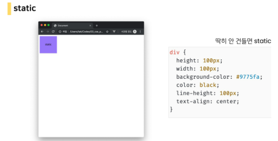

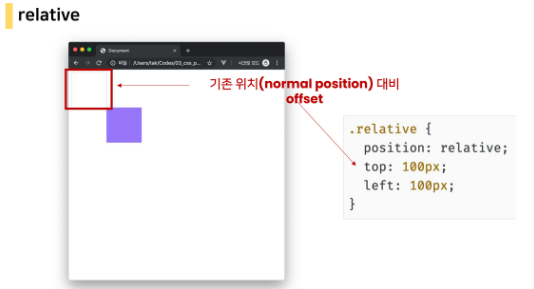

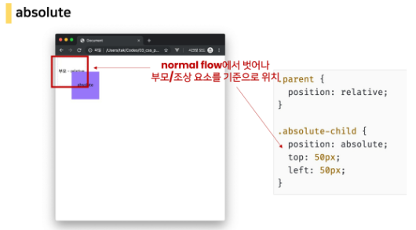

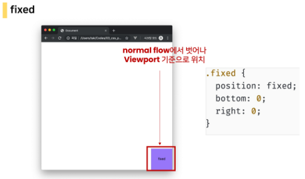

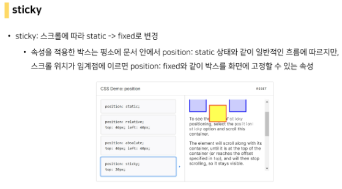

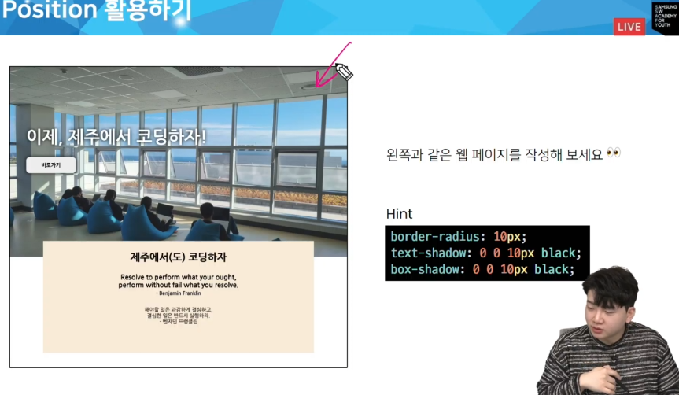

해보기 - google 워케이션

자손 서낵자 : 문서 구조에서 특정
